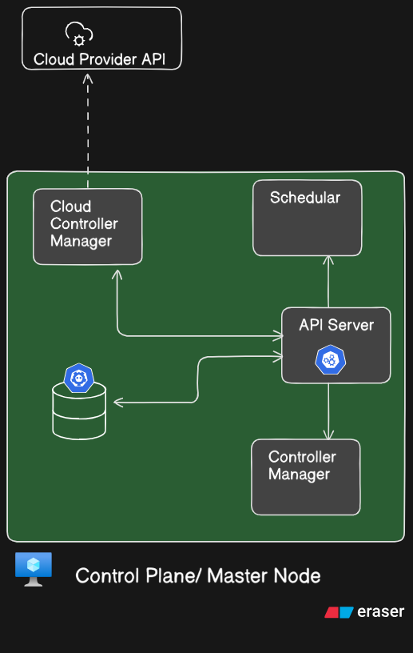
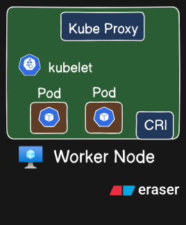
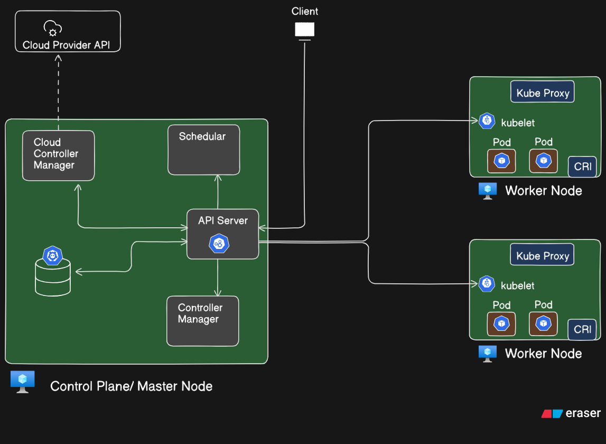

# Kubernetes Architecture: Introduction

Before we dive into how Kubernetes works under the hood, it's essential to understand the **architecture** that powers it. Kubernetes is a distributed system built to manage containerized applications at scale, and it achieves this through a robust and modular architecture.

At its core, the Kubernetes architecture is divided into two major parts:

1. **Control Plane (Master Node)** – This is the brain of the cluster. It makes global decisions, handles orchestration logic, and ensures that the desired state of the system is always maintained.
2. **Worker Nodes** – These are the machines (virtual or physical) where your applications actually run inside containers, grouped as Pods.

Each of these components is responsible for a distinct part of the orchestration process—from accepting user commands to scheduling Pods and managing their lifecycle across nodes.

In this chapter, we will break down:
- The individual components of the Control Plane and Worker Nodes
- Their responsibilities
- How they interact with one another
- The complete lifecycle of a request, from creation to execution

By the end of this chapter, you will have a strong conceptual foundation of how Kubernetes orchestrates your application infrastructure efficiently and reliably.

## The Control Plane / Master Node in Kubernetes



In a Kubernetes cluster, there are two broad categories of components:

- **Control Plane (Master Node)**: Responsible for managing the cluster state and orchestration decisions
- **Worker Nodes**: Responsible for running actual workloads (Pods)

Let's begin with the **Control Plane**.

---

### Overview of the Control Plane

The **Control Plane** is like the brain of Kubernetes. It is responsible for the **global decisions** of the cluster — like scheduling, scaling, and responding to cluster events — and for exposing the Kubernetes API to users and internal components.

Here are the key components inside the Control Plane:

---

### API Server

- Acts as the **front door** or **gateway** to the Kubernetes cluster.
- It is the only component in the Control Plane that interacts with every other component.
- Every `kubectl` command you run (e.g., `kubectl get pods`) hits the **API Server**, which then fetches the relevant data from the underlying store or routes it to the appropriate internal component.

> **Think of it as the HTTP REST server for Kubernetes.**

- It exposes a RESTful API and communicates using JSON over HTTP(S).
- All other components (Scheduler, Controller Manager, kubelet, etc.) talk to the API Server.
- API requests (like creating a Pod, fetching logs, updating configuration) are all **logged and validated** here.

---

### Scheduler

- Officially called `kube-scheduler`
- It is responsible for **assigning newly created Pods** to nodes (i.e., scheduling them).

#### How it works:

- Watches for Pods that are **waiting for scheduling**
- Looks at the requirements of the Pod (CPU, memory, affinity rules, etc.)
- Evaluates which node can accommodate the Pod based on constraints
- Selects the most appropriate node and **binds the Pod** to it

> Note: It **does not** run the Pod — it only _decides where_ it should run.

---

### Controller Manager

This is a daemon that runs multiple controllers in a single process. Each **controller** is a loop that watches the desired state of some part of the cluster and tries to make the actual state match it.

Common types of controllers:

- **Deployment Controller** – Ensures that the desired number of Pods are always running for a Deployment.
- **ReplicaSet Controller** – Manages the replicas of a Pod.
- **Namespace Controller** – Watches for namespace creation/deletion.
- **Node Controller** – Watches node availability (e.g., marks nodes as "NotReady" if they stop responding).

> Think of controllers as **autopilots** — constantly reconciling reality with the desired state.

---

### etcd

- A **key-value store** and the **source of truth** for the cluster
- Stores **all configuration data**, **cluster state**, and **metadata**
- Highly consistent and reliable
- Used by API Server to read/write the cluster state

#### Example:

When you run:

```bash
kubectl get pods
```

- The request goes to the **API Server**
- API Server fetches the list of pods from **etcd**
- API Server returns the data to your terminal

Similarly, if you **create a Pod**, the API Server:

1. Validates the request
2. Stores the definition in `etcd`
3. Passes it to the Scheduler and Controller Manager

---

### Cloud Controller Manager

This component exists **only if you're using Kubernetes on a public cloud** (like GKE, EKS, or AKS). It abstracts the cloud-specific logic out of the main Kubernetes components.

#### It is responsible for:

- Communicating with the **cloud provider's APIs**
- Managing resources like:
    - Load balancers
    - Volumes
    - Nodes (via auto-scaling groups)
    - IP addresses

#### How it works:

- API Server receives a request (e.g., to create a LoadBalancer service)
- It forwards the request to **Cloud Controller Manager**
- The Cloud Controller Manager then interacts with the **Cloud Provider API**
- After provisioning, it writes the state back into `etcd`

---

### Internal Communication Flow

> All communication between these components **flows through the API Server**.

- The Scheduler doesn't talk directly to `etcd`
- The Controller Manager doesn't talk directly to the Scheduler
- Even the Cloud Controller Manager interacts via the API Server
    
This centralization ensures:

- All operations go through **access control, authentication, and audit logging**
- Consistency and synchronization via a single source of truth

---

### Summary

|Component|Role|
|---|---|
|**API Server**|Central control hub and RESTful interface to the cluster|
|**Scheduler**|Assigns Pods to Nodes|
|**Controller Manager**|Runs various reconciliation loops to maintain cluster state|
|**etcd**|Stores all data and state of the cluster|
|**Cloud Controller Manager**|Cloud-specific integration layer for managed Kubernetes|

---

## Worker Node in Kubernetes



A **Worker Node** is a machine (virtual or physical) that hosts the **containers** for running your application workloads.

While the Control Plane makes the decisions, **Worker Nodes execute those decisions**.

Each Worker Node contains a few critical components to function effectively in the Kubernetes cluster.

---

### Components of a Worker Node

---

#### kubelet

- `kubelet` is an **agent** that runs on every node in the cluster.
- It is the bridge between the **API Server (control plane)** and the **containers running on the node**.

##### Responsibilities:

- Registers the node with the Kubernetes API Server.
- Watches for Pod specifications from the API Server.
- Ensures that the specified containers are running and healthy.
- Reports back to the API Server with the **status of the node and Pods**.

> If a Pod crashes or stops, kubelet will try to restart it based on the defined policy (e.g., `Always`, `OnFailure`).

However, kubelet **does not manage containers directly** — it delegates that responsibility to a **container runtime**.

---

#### Container Runtime Interface (CRI)

The **Container Runtime** is the software responsible for:

- Pulling container images
- Starting and stopping containers
- Managing container lifecycle

Examples of container runtimes:

- Docker (deprecated in newer Kubernetes versions)
- **containerd**
- **CRI-O**

Kubelet uses the **Container Runtime Interface (CRI)** to communicate with the container runtime underneath.

> The container runtime is what actually launches and manages the containers on the system.

---

#### Pods

- **Pods** are the smallest unit of deployment in Kubernetes and represent one or more containers.
- The Scheduler in the Control Plane assigns Pods to this node.
- Once a Pod is assigned, kubelet ensures the Pod runs on the node using the container runtime.

Each Pod on a worker node:

- Gets a unique IP
- Shares networking and storage if multiple containers are inside

---

#### Kube Proxy

- `kube-proxy` is the **networking component** on each node.
- It maintains the **network rules** for Pod-to-Pod communication and **Service IP routing**.

##### Key Roles:

- Implements **iptables** or **IPVS** rules to direct traffic to the right Pod
- Handles **load balancing** for traffic directed to Services
- Ensures **network accessibility** between services and across nodes

> Think of kube-proxy as the internal DNS traffic cop that routes requests efficiently across the cluster.

---

### How It All Works Together

Let's tie this into a real flow:

1. You create a Pod using:
    ```bash
    kubectl apply -f pod.yaml
    ```
2. API Server logs the request, validates it, and saves it in **etcd**.
3. The **Scheduler** picks an appropriate Worker Node and binds the Pod to it.
4. On the assigned node:
    - `kubelet` sees the new Pod specification
    - It uses the **Container Runtime (CRI)** to pull the image and run the container
    - The container(s) are launched inside a **Pod**
    - `kube-proxy` ensures that networking rules are updated for communication

---

### Summary of Worker Node Components

|Component|Role|
|---|---|
|**kubelet**|Connects node to API Server, ensures Pod containers are running|
|**CRI**|Container engine (e.g., containerd, CRI-O) that actually runs containers|
|**Pods**|Encapsulate application containers|
|**kube-proxy**|Maintains networking and service routing rules|

---

## Summary Table: Control Plane vs Worker Node

|Control Plane|Worker Node|
|---|---|
|API Server, Scheduler, Controllers|kubelet, kube-proxy, CRI, Pods|
|Global decision-making|Execution of workloads|
|Stores state in etcd|Runs containerized applications|
|Does not run application containers|Responsible for container lifecycle|

---

## Complete Kubernetes Architecture



Now that we've explored each component of Kubernetes in isolation, let's bring everything together and walk through the **complete flow of a Kubernetes request** from start to finish.

This full diagram represents the Kubernetes architecture in action, with a Control Plane managing multiple Worker Nodes.

---

### Step-by-Step Request Lifecycle

#### Client Sends a Request

A developer or administrator uses `kubectl` to interact with the cluster:

```bash
kubectl apply -f my-app.yaml
```

This request is sent to the **API Server**, the main entry point of the cluster.

#### API Server Receives and Validates the Request

The **API Server**:

- Authenticates and authorizes the request
- Validates the manifest
- Stores the desired state in **etcd**, the key-value store used by Kubernetes

#### Scheduler Assigns the Pod

The **Scheduler**:

- Watches for unscheduled Pods
- Selects the most suitable Worker Node
- Binds the Pod to that node (through the API Server)

#### Controller Manager Ensures Desired State

The **Controller Manager**:

- Monitors the actual state of the system
- Compares it with the desired state (as defined in etcd)
- Initiates actions to reconcile differences, such as creating or restarting Pods

#### Cloud Controller Manager (for Managed Cloud)

If you're using a managed Kubernetes service (EKS, AKS, GKE):

- The **Cloud Controller Manager** interacts with cloud provider APIs
- It provisions cloud-specific resources (e.g., LoadBalancers, Volumes)
- These changes are also recorded in etcd

#### Kubelet on the Worker Node Acts

On the selected Worker Node:

- The **kubelet** receives instructions from the API Server
- It invokes the **Container Runtime Interface (CRI)** (e.g., containerd, CRI-O) to:
    - Pull the container image
    - Launch the container(s) in a Pod

#### kube-proxy Manages Networking

The **kube-proxy**:

- Configures network routing rules (via iptables or IPVS)
- Enables communication between services and Pods
- Ensures traffic is correctly routed and load-balanced across Pods

---

### Summary of Component Collaboration

|Component|Responsibility|
|---|---|
|API Server|Central API interface and request router|
|etcd|Persistent, consistent state store|
|Scheduler|Assigns Pods to nodes based on resource availability|
|Controller Manager|Reconciles desired and actual state of resources|
|Cloud Controller Manager|Manages cloud provider-specific resources|
|kubelet|Ensures container state on Worker Nodes|
|CRI|Pulls images and manages container lifecycle|
|kube-proxy|Manages Pod-to-Pod and Pod-to-Service networking|

---

### Conclusion

This full system flow illustrates how Kubernetes combines the intelligence of the **Control Plane** with the execution power of **Worker Nodes**. Every request is processed, validated, stored, scheduled, and executed through a well-coordinated series of steps and components.

Understanding this architecture is crucial for mastering Kubernetes operations, optimizing performance, and troubleshooting complex workloads in production environments.
