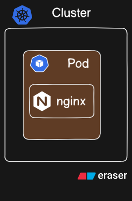

> ⏱️ Estimated reading time: 15 min


# What is a Pod in Kubernetes?

A **Pod** is the **smallest and simplest deployable unit** in Kubernetes. It represents a single instance of a running process in your cluster.



At first glance, it may look like a Pod is just a wrapper around a container (like an NGINX web server). But there's more going on beneath the hood.

---

## Understanding the Pod

A Pod can contain:

- **One container** (most common)
- Or **multiple tightly coupled containers** that need to share resources like storage, network, and lifecycle

Every container in a pod:

- Shares the same **network namespace** (IP address and port space)
- Can communicate with other containers in the same pod via `localhost`
- Can share **storage volumes**

So why not just run everything in a single container?

Because Kubernetes gives us patterns and primitives for separating concerns cleanly while still packaging tightly related tasks.

---

## Real-World Scenarios for Multi-Container Pods

While single-container Pods are standard, **multi-container Pods** are used in the following scenarios:

### Sidecar Containers

These run alongside the main application and **enhance or extend** its functionality.

**Example Use Case:**  
You have a web server container and a **log processor container** (like Fluentd) in the same Pod. The sidecar streams logs from the shared volume to an external logging service.

### Init Containers

These are specialized containers that **run before the main container starts**.

**Example Use Case:**  
An init container downloads configuration files or performs checks (e.g., wait until a DB is available) before the main app boots up.

### Adapter/Proxy Containers

Used for **communication mediation or protocol transformation**.

**Example Use Case:**  
An NGINX proxy container that accepts HTTP traffic and routes it to an internal gRPC service container.

### Monitoring Containers

Used for exposing metrics or application health.

**Example Use Case:**  
An application container writes metrics to a file, and a helper container (like a Prometheus exporter) reads and exposes them.

---

## Creating Pods in Kubernetes

There are **two approaches** to creating Pods in Kubernetes:

---

### Imperative Way

This method involves directly issuing commands to the cluster. It's useful for quick testing.

#### Command:

```bash
kubectl run nginx-pod --image=nginx
```

This:
- Creates a new Pod named `nginx-pod`
- Runs it with the `nginx` image

#### Verify:

```bash
kubectl get pods
kubectl describe pod nginx-pod
```

But this pod is ephemeral. If it crashes, it won't be recreated unless it's part of a higher-level abstraction like a Deployment.

---

### Declarative Way

This is the recommended and **production-grade** method using YAML configuration files.

#### `nginx-pod.yaml`

```yaml
apiVersion: v1
kind: Pod
metadata:
  name: nginx-pod
spec:
  containers:
    - name: nginx
      image: nginx
      ports:
        - containerPort: 80
```

#### Apply the config:

```bash
kubectl apply -f nginx-pod.yaml
```

#### Benefits:
- Version control (YAML files can be stored in Git)
- Repeatability and automation
- Infrastructure as code

---

## How `kubectl` Works Behind the Scenes

Every time you run a `kubectl` command, you're not directly talking to the Kubernetes nodes. Instead, `kubectl` interacts with the **Kubernetes API Server**.

Here's what happens step by step:

1. You run a command like:
    ```bash
    kubectl get pods
    ```
2. `kubectl` sends an **HTTP request to the API Server** (usually via HTTPS):
    ```
    GET /api/v1/namespaces/default/pods
    ```
3. The **API Server**:
    - Authenticates the request
    - Validates it
    - Forwards it to the appropriate component (e.g., kubelet on a node, etcd for data)
4. The **response** is sent back to `kubectl`, which displays it in your terminal.

> Think of `kubectl` as a REST client and the **Kubernetes API Server** as the central control tower of the cluster.

You can even simulate the raw REST call using:

```bash
kubectl get pods -v=8
```

This will show the full request being made under the hood.

---

## Summary

- A **Pod** is the smallest deployable unit in Kubernetes and can hold one or more containers.
- Multi-container Pods follow specific design patterns (Sidecar, Init, Adapter, Monitoring).
- Pods can be created **imperatively (via commands)** or **declaratively (via YAML)**.
- All interactions via `kubectl` go through the **Kubernetes REST API**, handled by the **API Server**.

---
