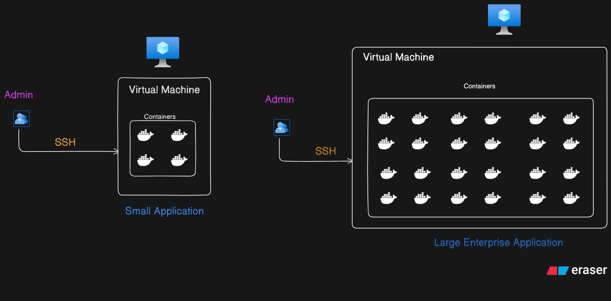
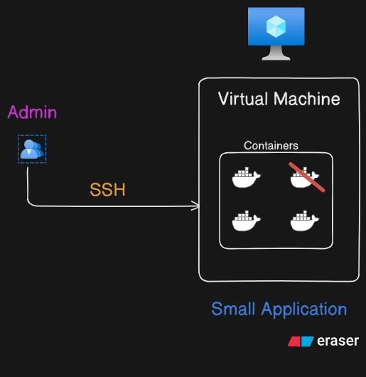
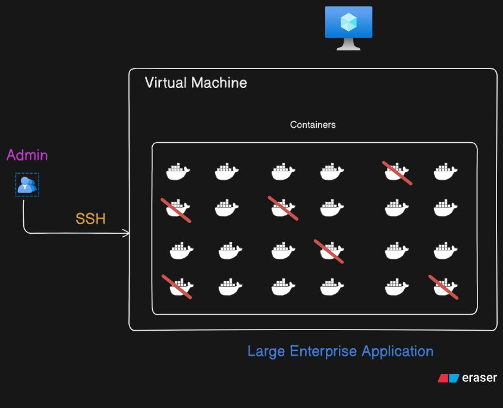

# Why Do We Need Kubernetes if We Already Have Docker?

At first glance, Docker seems to be the perfect solution for containerization—it helps us package our applications along with all their dependencies into lightweight, portable containers. But as we move from small projects to large, production-grade systems, we begin to hit the limits of what Docker alone can manage.

Let’s understand this with two practical scenarios: one involving a small application, and another involving a large-scale enterprise system.

---

## Scenario 1: Small Application Deployment

Suppose you're deploying a **small web application** on a Virtual Machine (VM). You’ve containerized your services—maybe one for the backend, one for the frontend, and another for a database. All of these run inside Docker containers on a single VM.

Now, imagine one of these containers crashes.

In such a case, the admin or developer would typically:

- SSH into the VM
- Check the container status using `docker ps`
- Restart the failed container manually using `docker start` or `docker-compose up`

And that's perfectly fine.

This is manageable because:

- There are only a few containers
- The failure rate is low
- The environment is easy to oversee manually

But this model doesn't scale.

---

## Scenario 2: Large-Scale Enterprise Application

Now let’s jump into a real-world enterprise scenario.

Imagine a **complex microservices-based application** with:

- Multiple teams working on different services
- Containers running across several VMs or even across data centers
- Possibly thousands of containers running simultaneously

Here, things start to break down.

What happens when just **a few containers crash**?

Sure, you can still SSH into the machine and restart them manually.

But is that viable?

Absolutely not.

### Why? Because:

- **There are too many containers** to track manually
- **Failures are inevitable** in distributed systems — you need automatic recovery
- **Scaling needs** are dynamic — manual scaling isn't efficient
- **Service discovery** becomes difficult — how do services talk to each other reliably?
- **Load balancing** across containers is not automatic
- **Resource allocation** and utilization aren't optimized manually
- **Security, monitoring, and logging** need consistent policies

---

## The Need for an Orchestrator

This complexity is what **gives rise to the need for a container orchestration system** — a system that can:

- **Automatically restart** failed containers
- **Distribute workloads** across nodes
- **Scale containers** up or down based on traffic
- **Ensure high availability**
- **Monitor container health**
- **Manage networking and service discovery**

And that system is **Kubernetes**.

---

## Kubernetes to the Rescue

Kubernetes (often abbreviated as **K8s**) solves all the problems we just mentioned. It acts as a powerful, automated orchestration platform that manages containerized applications across a cluster of machines.

Here's what Kubernetes brings to the table:

-  **Scalability** – Scale services up/down with a single command or automatically
-  **High Availability** – Distributes containers to ensure minimal downtime
-  **Fault Tolerance** – Automatically reschedules failed containers
-  **Declarative Management** – Define your infrastructure in YAML/JSON files
-  **Orchestration** – Handles scheduling, networking, configuration, and deployment strategies

---

## Summary

Docker gives us the building blocks. Kubernetes gives us the **automated infrastructure** to manage and scale those blocks.

If Docker is like installing engines in cars, Kubernetes is the entire traffic control and road network system that ensures:

- The cars move efficiently
- Traffic jams (resource bottlenecks) are handled
- Broken cars (failed containers) are taken off the road and replaced

So before diving into Kubernetes concepts, it's important to internalize **why Kubernetes is needed**—especially in production environments where scale, reliability, and agility are critical.

---

