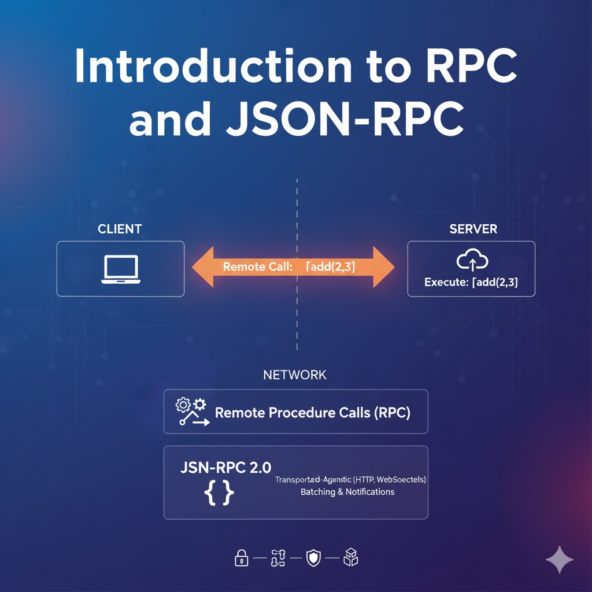
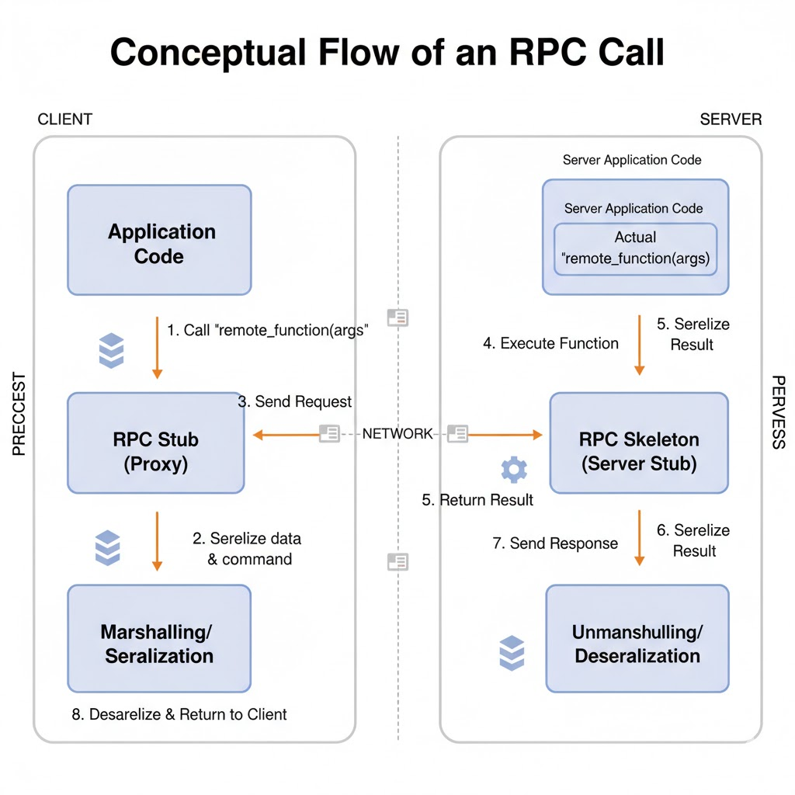
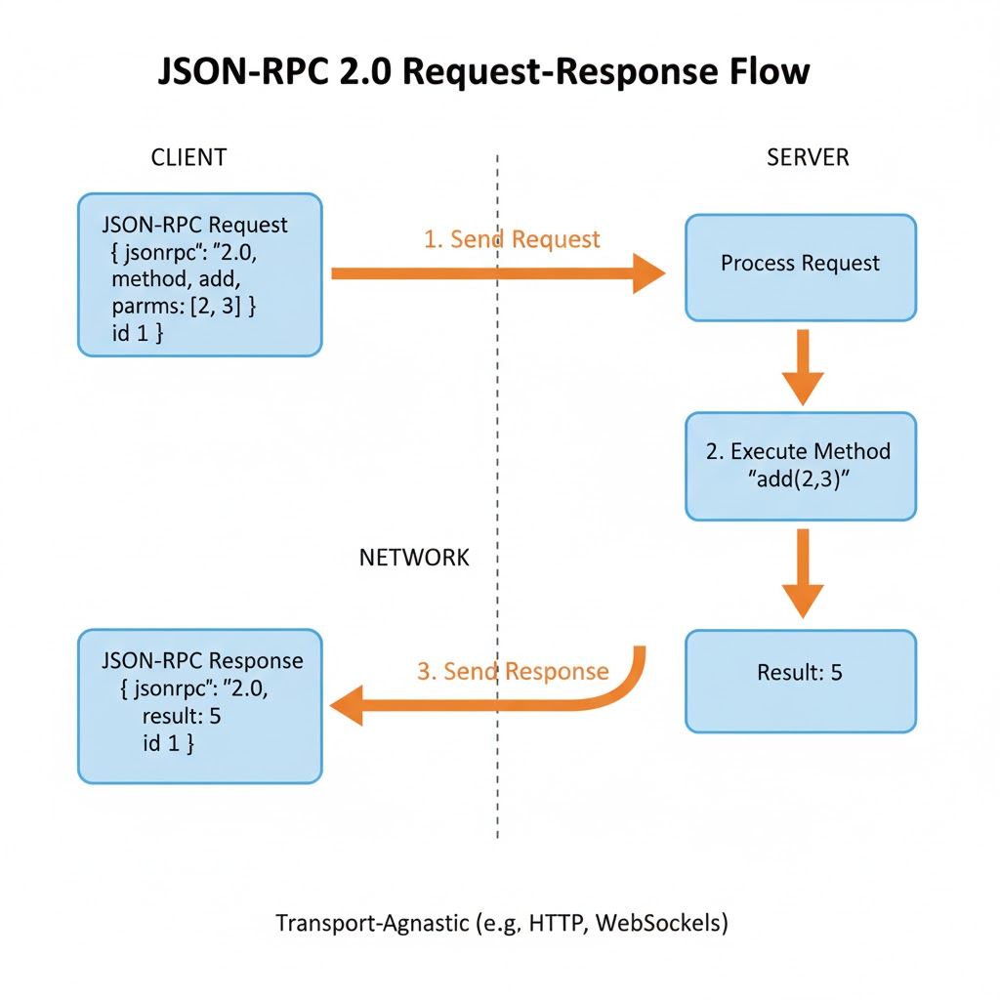
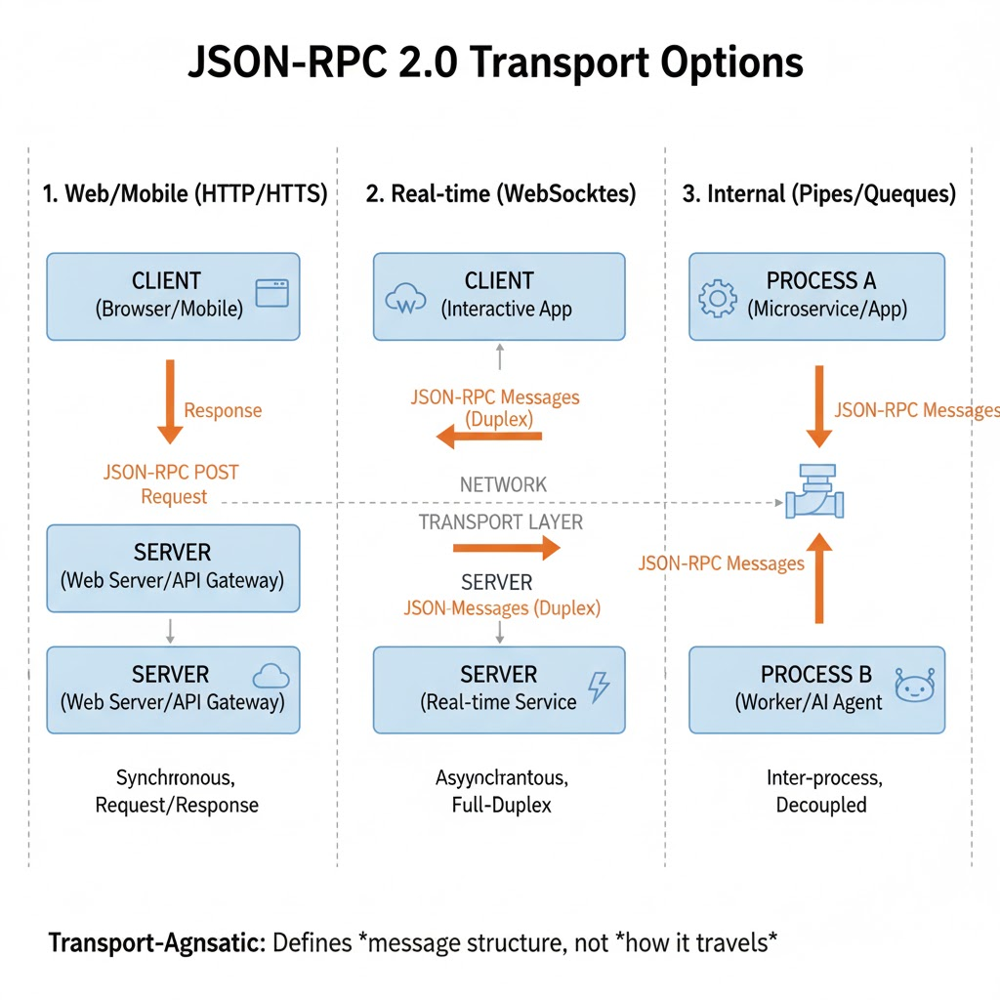
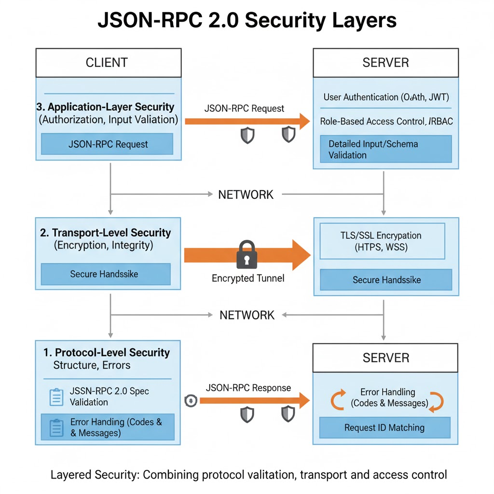

## Introduction to RPC and JSON-RPC

When we write software, functions are usually invoked locally — you call them, they run inside your process, and you get a result back. But what if the function you want to call lives on another machine? Maybe a cloud service, an AI model, or an internal microservice in your organization.

That’s where **Remote Procedure Calls (RPCs)** come in.

RPC allows a program to execute a function **remotely** but interact **as if it were local**.  
It hides the complexity of networking, serialization, and transport behind a simple call interface.  
The calling code doesn’t need to know _how_ or _where_ the function runs — only _what_ it does.



---

### The Essence of RPC

In a typical RPC setup:

1. The **client** calls a function, say `get_user(42)`.
    
2. This call is transformed into a **request message** (containing the method name, arguments, and an ID).
    
3. The message is sent to a **remote server** over a network.
    
4. The server executes the method and sends back a **response message** with the result.
    

To the programmer, it feels like a simple local call — but underneath, it’s a **request–response exchange** happening across systems.

??? info "Historical Context"  
    The idea of RPC dates back to the 1980s. It was formalized by Birrell and Nelson (1984) and later implemented in technologies like XML-RPC, CORBA, and SOAP. JSON-RPC is a **modern, minimal successor** to those early RPC protocols.

---

### Why JSON?

JSON (JavaScript Object Notation) became the natural choice for modern RPC protocols for a few reasons:

1. **Lightweight and Readable:** Easy to read and debug without extra tooling.
    
2. **Language-Agnostic:** Works seamlessly across Python, JavaScript, Java, Go, and more.
    
3. **Ubiquitous Support:** Every major language can serialize and parse JSON natively.
    
4. **Web-Native:** Perfect fit for HTTP, WebSockets, and web-based clients.
    

??? tip "Design Insight"  
    Choosing JSON makes RPC systems interoperable — a Python backend and a JavaScript frontend can talk using the same protocol without any binary decoding or code generation.

---

### JSON-RPC 2.0 — The Modern Standard

**JSON-RPC 2.0** is a formal specification that defines _how_ to perform remote calls using JSON messages.  
It standardizes the shape of the request, response, and error messages — ensuring that any two systems that follow the spec can communicate flawlessly.

A minimal example of a JSON-RPC call looks like this:

```json
{
  "jsonrpc": "2.0",
  "method": "add",
  "params": [2, 3],
  "id": 1
}
```

and the corresponding response:

```json
{
  "jsonrpc": "2.0",
  "result": 5,
  "id": 1
}
```


This exchange is **transport-agnostic** — it could happen over HTTP, WebSockets, or even a local pipe between two processes.  
What matters is not _how_ the message moves, but _how it is structured._

---

### Stateless and Transport-Agnostic

A JSON-RPC system is **stateless**, meaning each message carries all the information needed for execution.  
The server doesn’t rely on any previous requests — making it easier to scale horizontally or retry safely.

It’s also **transport-agnostic**, meaning it doesn’t care whether the message travels via:

- HTTP POST request
    
- WebSocket frame
    
- Standard input/output (as used in local agents)
    

This flexibility makes it perfect for **agent frameworks** and **AI systems**, where communication can happen within a single machine or across distributed networks.

!!! note "Why This Matters"  
    In LLM-based frameworks (like MCP or LangGraph), agents often need to communicate using a consistent format — regardless of where they run. JSON-RPC provides that universal structure.

---

### Example Analogy

Imagine calling your friend to ask, “Can you calculate 2 + 3 for me?”

- You speak the **method** (`calculate`)
    
- Provide **parameters** (`2` and `3`)
    
- Expect a **result** (`5`)
    

That conversation, if structured into a JSON message, _is_ JSON-RPC in spirit.  
It’s a shared language both sides understand — structured, predictable, and easy to automate.

---

### Example in Code Context

Below is a conceptual visualization of how it might look in a Pythonic scenario:

```python
# Local call
result = add(2, 3)

# Remote call using JSON-RPC
rpc_message = {
    "jsonrpc": "2.0",
    "method": "add",
    "params": [2, 3],
    "id": 1
}
send_to_server(rpc_message)
```

The logic stays the same — only the transport mechanism changes.

---

### Probable Doubts & Clarifications

**Q1.** _If I send JSON data via HTTP, is it automatically JSON-RPC?_  
**A.** No. JSON-RPC follows a specific schema (`jsonrpc`, `method`, `params`, `id`). Plain JSON over HTTP is just data exchange, not RPC.

**Q2.** _Is REST also a form of RPC?_  
**A.** Conceptually both enable remote interaction, but REST is a **software architecture**, while JSON-RPC is a **messaging protocol**. REST revolves around resources; JSON-RPC revolves around methods.

**Q3.** _Why call it “message grammar”?_  
**A.** Because JSON-RPC defines the **exact sentence structure** for how machines talk — which fields, what order, and what types. That’s why it’s compared to grammar, whereas REST is more like a writing style.

---

## Evolution of the Specification (1.0 → 2.0)

When JSON-RPC was first introduced, its mission was simple — make **remote procedure calls** lightweight, readable, and easy to implement. The earliest version, **JSON-RPC 1.0**, succeeded in that goal but lacked the structure and resilience needed for complex, distributed systems.

To understand the design of version 2.0, we’ll look at how it evolved from that minimal first draft.

---

### JSON-RPC 1.0 — A Minimal Beginning

The original 1.0 spec was intentionally simple.  
A message looked something like this:

```json
{ "method": "add", "params": [2, 3], "id": 1 }
```

That’s it. No version field, no error schema — just method, parameters, and ID.

While this simplicity made early experimentation easy, it came with significant drawbacks:

1. **No Standard Error Format:** Each server returned errors differently.
    
2. **No Versioning:** Clients couldn’t negotiate features or compatibility.
    
3. **No Notifications:** Every request required a response, even for trivial updates.
    
4. **No Batching:** Multiple calls meant multiple network round trips.
    
5. **Loose Validation:** Servers couldn’t easily detect malformed requests.
    

In other words, it worked fine for toy systems, but not for production APIs where reliability and debugging mattered.

??? info "Historical Note"  
    JSON-RPC 1.0 emerged around the same time as XML-RPC and early REST experiments. The community quickly realized that while human-readable formats like JSON were excellent, they needed a stricter contract to avoid ambiguity between client and server.

---

### JSON-RPC 2.0 — Stabilization and Formalization

Version 2.0, finalized in 2010, fixed those issues. It didn’t change the philosophy — just the discipline. The protocol was hardened into a **deterministic message grammar**.

**Key Additions in 2.0:**

|Category|Version 1.0|Version 2.0|Why It Matters|
|---|---|---|---|
|**Version Field**|Absent|`"jsonrpc": "2.0"` (mandatory)|Ensures both sides speak the same spec.|
|**Error Object**|Free-form text|Standard structure: `code`, `message`, `data`|Enables machine-readable error handling.|
|**Notifications**|Not defined|Requests without `id` → no response expected|Supports “fire-and-forget” actions like logging.|
|**Batch Calls**|Not defined|Arrays of requests|Improves efficiency and concurrency.|
|**Parameter Flexibility**|Positional only|Named or positional|Increases readability and supports optional params.|
|**Transport Neutrality**|Implicit HTTP|Explicitly transport-agnostic|Works equally well over HTTP, WebSockets, or STDIO.|

---

### Example: Batch Request in 2.0

A **batch request** allows multiple calls in one network exchange:

```json
[
  { "jsonrpc": "2.0", "method": "add", "params": [1, 2], "id": 1 },
  { "jsonrpc": "2.0", "method": "subtract", "params": [5, 3], "id": 2 }
]
```

And the **server’s response** might look like:

```json
[
  { "jsonrpc": "2.0", "result": 3, "id": 1 },
  { "jsonrpc": "2.0", "result": 2, "id": 2 }
]
```

Each call is independent, and results can arrive in any order.  
The `id` values ensure that clients match them correctly.

---

### Why 2.0 Became the Standard

The upgrade to 2.0 wasn’t about adding bells and whistles — it was about **creating trust** between communicating systems.  
By enforcing a strict structure, JSON-RPC became:

- Easier to implement correctly across languages.
    
- Safer to use in multi-threaded, distributed systems.
    
- Easier to debug because every response followed the same pattern.
    

This made it ideal for **AI systems**, **agent frameworks**, and **tool orchestration**, where clarity and determinism are essential.

??? tip "For Developers"  
    If you see `"jsonrpc": "2.0"` in an API payload, that's your signal you're working with a formal, spec-compliant protocol — not just ad hoc JSON.

---

### Probable Doubts & Clarifications

**Q1.** _Why was the version field made mandatory?_  
**A.** To prevent silent incompatibility. Without it, clients and servers might assume the same message rules but interpret them differently.

**Q2.** _How do batch requests help in real-world systems?_  
**A.** They reduce network latency and make it possible to process multiple calls concurrently. This is critical in systems where agents or LLM tools invoke many micro-operations at once.

**Q3.** _Can notifications and standard calls be mixed in a batch?_  
**A.** Yes. Notifications (requests without `id`) are simply ignored by the server when forming responses, while normal calls generate response objects.

---

## Core Message Structures

At the heart of JSON-RPC lies a simple but powerful idea — **every interaction is a structured message**.  
Unlike ad hoc JSON APIs that vary wildly in format, JSON-RPC standardizes the way requests, responses, and errors are represented.

This predictable structure is what allows different languages, agents, and systems to communicate seamlessly.

---

### The Three Fundamental Objects

Every JSON-RPC exchange revolves around three building blocks:

1. **Request Object** — the client asking for a procedure to be executed.
    
2. **Response Object** — the server’s reply to that request.
    
3. **Error Object** — a structured report of what went wrong.
    

Let’s examine each in turn.

---

### 1. The Request Object

A **request** is a message sent by the client to invoke a method on the server.

```json
{
  "jsonrpc": "2.0",
  "method": "add",
  "params": [2, 3],
  "id": 1
}
```

**Required Fields**

|Field|Type|Purpose|
|---|---|---|
|`jsonrpc`|string|Must be `"2.0"` — identifies the protocol version.|
|`method`|string|The name of the remote function to call.|
|`params`|array or object|Input arguments — optional.|
|`id`|string, number, or null|A unique identifier for matching responses.|

There’s no ambiguity here — the message always declares its version and method name explicitly.

??? info "Named vs Positional Parameters"  
    You can send parameters as an **array** (`[2,3]`) or as an **object** (`{"a":2,"b":3}`).  
    Named parameters are more readable, while positional ones are compact and slightly faster to serialize.

---

### 2. The Response Object

When the server successfully executes a request, it returns a **response object**.

```json
{
  "jsonrpc": "2.0",
  "result": 5,
  "id": 1
}
```

**Response Rules**

- The `id` must match the request’s `id`.
    
- The response includes either a `result` **or** an `error` — never both.
    
- The structure ensures predictable parsing by clients.
    

If the call failed, the server sends an error object instead of `result`.

---

### 3. The Error Object

An **error object** communicates structured failure.

```json
{
  "code": -32601,
  "message": "Method not found",
  "data": { "method": "multiply" }
}
```

**Error Fields**

|Field|Type|Purpose|
|---|---|---|
|`code`|integer|A standard or application-defined error code.|
|`message`|string|A short description of the error.|
|`data`|any|Optional details for debugging or context.|

**Standard Error Codes**

|Code|Meaning|Common Cause|
|---|---|---|
|−32600|Invalid Request|Malformed message.|
|−32601|Method Not Found|Unknown or unregistered function.|
|−32602|Invalid Params|Wrong argument type or structure.|
|−32603|Internal Error|Exception during execution.|
|−32000 – −32099|Server-defined|Custom application-level errors.|

---

### 4. Putting It Together

A single JSON-RPC interaction can be visualized like this:

```json
// Request
{ "jsonrpc": "2.0", "method": "add", "params": [2, 3], "id": 1 }

// Success Response
{ "jsonrpc": "2.0", "result": 5, "id": 1 }

// Error Response
{
  "jsonrpc": "2.0",
  "error": {
    "code": -32601,
    "message": "Method not found"
  },
  "id": 1
}
```

This structure is deliberately simple — yet powerful enough to represent all remote interactions, from local agent calls to distributed AI tool orchestration.

---

### 5. Why This Design Matters

A fixed schema allows:

- **Deterministic parsing:** clients always know what to expect.
    
- **Cross-language reliability:** any compliant client can talk to any compliant server.
    
- **LLM safety:** large language models can generate or interpret structured responses consistently.
    

In multi-agent setups, this predictability is crucial — agents don’t guess what a “success” or “error” looks like; they parse it.

??? tip "Best Practice for AI Systems"  
    When integrating LLMs with JSON-RPC, ensure you log both the raw `request` and `response` payloads. This makes debugging token generation or tool invocation errors far easier.

---

### Probable Doubts & Clarifications

**Q1.** _Can `result` and `error` appear together?_  
**A.** No. A response must contain either `result` or `error`. Having both violates the spec.

**Q2.** _When is `id` set to `null`?_  
**A.** When a request fails so early (e.g., malformed JSON) that the server can’t determine the `id`. The spec requires returning `"id": null` in such cases.

**Q3.** _Can we define custom error codes?_  
**A.** Yes, in the `-32000` to `-32099` range. These are reserved for application-specific errors (e.g., validation failures, permission issues).

---

## Requests in JSON-RPC

Every interaction in JSON-RPC begins with a **request** — the client’s way of asking the server to perform a specific operation.  
A request isn’t just a message; it’s a structured intent: _“Call this method, with these parameters, and give me the result.”_

Because JSON-RPC was designed for simplicity and flexibility, it supports multiple request forms — standard calls, notifications, and batch requests.

---

### 1. Standard Requests

A standard request is what most developers think of when they hear “API call.”  
It expects a response, and it carries a unique `id` to match the reply.

```json
{
  "jsonrpc": "2.0",
  "method": "add",
  "params": [2, 3],
  "id": 1
}
```

When the operation completes, the server sends a response containing either:

```json
{ "jsonrpc": "2.0", "result": 5, "id": 1 }
```

or, if something goes wrong:

```json
{
  "jsonrpc": "2.0",
  "error": { "code": -32601, "message": "Method not found" },
  "id": 1
}
```

The matching `id` guarantees the client knows which request this result belongs to — even if multiple requests are in progress.

??? tip "Best Practice"  
    Always use unique `id`s for each request in concurrent systems.  
    Reusing the same ID for multiple calls can cause mismatched or overwritten results.

---

### 2. Positional vs Named Parameters

JSON-RPC allows two styles of parameters:

#### **Positional Parameters**

```json
"params": [2, 3]
```

These follow the order defined by the method signature — compact and fast, but less descriptive.

#### **Named Parameters**

```json
"params": { "a": 2, "b": 3 }
```

Named parameters increase clarity and flexibility, especially for optional arguments.

Many production APIs favor **named parameters** because they make debugging and versioning easier.

??? info "Practical Example"  
    Imagine a function that adds two numbers but later introduces a third, optional parameter for scaling.  
    If you use positional arguments, existing clients break.  
    With named arguments, they continue working because order no longer matters.

---

### 3. Notifications — Fire-and-Forget

A **notification** is a request sent without an `id`.  
The server performs the action but does **not send back a response**.

```json
{
  "jsonrpc": "2.0",
  "method": "logEvent",
  "params": { "message": "User logged in" }
}
```

Because there’s no `id`, the client can’t match a response — in fact, the spec forbids the server from sending one.

Use notifications when:

- The client doesn’t need confirmation.
    
- The operation is lightweight or purely side-effect-based (like logging or telemetry).
    

!!! note "Caution"  
    Notifications are **unacknowledged** — if a network failure occurs, the client won't know.  
    Use them only when reliability isn't critical.

---

### 4. Batch Requests

One of JSON-RPC 2.0’s most powerful features is the ability to send **multiple requests in one array**.  
This reduces network overhead and enables concurrent execution.

```json
[
  { "jsonrpc": "2.0", "method": "add", "params": [1, 2], "id": 1 },
  { "jsonrpc": "2.0", "method": "subtract", "params": [5, 3], "id": 2 },
  { "jsonrpc": "2.0", "method": "logEvent", "params": ["batchStart"] }  // notification
]
```

The server processes each independently and replies with an array of responses:

```json
[
  { "jsonrpc": "2.0", "result": 3, "id": 1 },
  { "jsonrpc": "2.0", "result": 2, "id": 2 }
]
```

Notice that the notification (`logEvent`) has no response.

??? info "Concurrency Implication"  
    The spec allows servers to process batched requests **in any order** or even **in parallel**.  
    Clients must always match responses by `id`, not by position.

---

### 5. Why Batch and Notification Matter in Modern Systems

These features may seem optional, but they are critical for **agentic AI frameworks** like MCP and LangGraph.  
In such systems, one agent might call multiple tools at once, mix synchronous and asynchronous work, and fire telemetry updates — all using JSON-RPC batch semantics.

Example scenario:

- `tools/call` for computation
    
- `resources/read` for data
    
- `logEvent` as a notification
    

All three can happen within a single JSON-RPC batch.

---

### Probable Doubts & Clarifications

**Q1.** _How does the server detect a notification?_  
**A.** By the absence of an `id` field. If there’s no `id`, it’s a one-way message and must not trigger a response.

**Q2.** _Can batch requests contain both notifications and normal calls?_  
**A.** Yes. Notifications are simply ignored in the server’s response array.

**Q3.** _What happens if a batch array is empty (`[]`)?_  
**A.** The server must return an error (`Invalid Request -32600`), as an empty batch is not allowed by the spec.

**Q4.** _Do batch requests guarantee order of execution?_  
**A.** No. Execution order is implementation-defined. Clients must rely on IDs, not order, for correlating responses.

---

## Responses & Error Handling

A request is only half the story. The other half — and arguably the more critical one — is the **response**.  
In JSON-RPC, every request (except notifications) must receive a **structured response** that tells the client exactly what happened — success or failure, never ambiguity.

This section explores how JSON-RPC standardizes responses and why that predictability makes it ideal for automation, testing, and AI agent workflows.

---

### 1. The Successful Response

When everything goes right, the server returns a **result object**:

```json
{
  "jsonrpc": "2.0",
  "result": 5,
  "id": 1
}
```

The rules are simple but strict:

|Field|Description|
|---|---|
|`jsonrpc`|Must be `"2.0"` — indicates protocol version.|
|`result`|The output of the requested method.|
|`id`|Must match the `id` of the request that triggered this response.|

This `id`-based pairing ensures that even if multiple requests are processed in parallel, each response finds its way back to the right caller.

---

### 2. The Error Response

If something fails — the method doesn’t exist, parameters are invalid, or the server throws an exception — the server must respond with an **error object** instead of a `result`.

```json
{
  "jsonrpc": "2.0",
  "error": {
    "code": -32601,
    "message": "Method not found",
    "data": { "method": "multiply" }
  },
  "id": 1
}
```

**Error responses follow the same top-level structure** (`jsonrpc` and `id`) but replace `result` with a structured `error`.  
The presence of `error` makes the meaning unambiguous: something went wrong.

---

### 3. Anatomy of the Error Object

The **error object** standardizes how failures are reported:

|Field|Type|Description|
|---|---|---|
|`code`|integer|A predefined or server-defined error code.|
|`message`|string|A brief, human-readable summary of the issue.|
|`data`|any|Optional field with extra context, debugging info, or stack trace.|

**Common Standard Error Codes**

|Code|Name|Typical Cause|
|---|---|---|
|−32600|Invalid Request|Message isn’t a valid JSON-RPC object.|
|−32601|Method Not Found|Unknown or unregistered method name.|
|−32602|Invalid Params|Parameter types or structure are incorrect.|
|−32603|Internal Error|Unexpected failure on the server side.|
|−32000 to −32099|Server-Defined Range|Application-specific errors (custom logic).|

---

### 4. Graceful Degradation

The reason JSON-RPC enforces structured error reporting is **graceful degradation** — a failing system should degrade predictably, not crash.  
For example, an LLM-powered server that hits a context limit shouldn’t return a raw traceback or plain text error; it should return a structured error like this:

```json
{
  "jsonrpc": "2.0",
  "error": {
    "code": -32603,
    "message": "LLM inference failed",
    "data": {
      "reason": "Prompt too long",
      "max_tokens": 4096
    }
  },
  "id": 42
}
```

The client (or another agent) can parse this, detect recoverable issues, and retry with smaller input — no guesswork needed.

??? info "Why This Matters for AI Systems"  
    Deterministic error formats let agents make decisions automatically.  
    If an LLM sees `"code": -32603`, it can infer _"retry or fallback"_ instead of hallucinating recovery steps.

---

### 5. Batch Responses

When a batch of requests is sent, the server must return an **array of responses**, one for each request that had an `id`. Notifications (no `id`) do not appear in the array.

```json
[
  { "jsonrpc": "2.0", "result": 3, "id": 1 },
  { "jsonrpc": "2.0", "error": { "code": -32602, "message": "Invalid params" }, "id": 2 }
]
```

Order doesn’t matter — the client matches each by `id`.

---

### 6. Invalid Requests

If the incoming message is malformed (e.g., not valid JSON or missing required fields), the server must still reply — but with `"id": null` because it cannot know which request failed.

```json
{
  "jsonrpc": "2.0",
  "error": { "code": -32600, "message": "Invalid Request" },
  "id": null
}
```

This ensures clients always receive a **syntactically valid** JSON-RPC response, even for invalid inputs.

!!! note "Error Hygiene"  
    Never expose internal stack traces in `message`.  
    Place detailed logs in the server console or in `error.data`, and sanitize them before sending to clients.

---

### 7. Mapping Application Errors

One of the elegant parts of JSON-RPC is that application-specific failures can be _mapped_ to structured error codes.

|Application Scenario|Example Code|Message|Notes|
|---|---|---|---|
|Validation Failure|-32001|"Invalid user data"|User input errors|
|Permission Denied|-32002|"Unauthorized"|Access control violation|
|Timeout|-32003|"Request timeout"|Long-running or unresponsive task|
|Dependency Error|-32004|"Upstream service failed"|External service errors|

In large ecosystems, this allows unified logging and recovery — an LLM agent or API client can apply consistent error-handling logic across very different systems.

---

### Probable Doubts & Clarifications

**Q1.** _Why can’t both `result` and `error` appear together?_  
**A.** Because it creates ambiguity. The spec enforces mutual exclusivity to ensure predictable parsing.

**Q2.** _What’s the difference between `-32601` and `-32603`?_  
**A.** `-32601` means the method doesn’t exist (client error). `-32603` means something broke during execution (server error).

**Q3.** _Why return `"id": null"` for invalid requests?_  
**A.** Because the server cannot know which request caused the failure — it might not even be valid JSON.

**Q4.** _Can the client define its own error codes?_  
**A.** Yes, within the server-defined range (`-32000` to `-32099`), as long as both sides agree on meaning.

---

## Concurrency & State

Up to this point, we’ve seen how a single JSON-RPC request travels to a server and returns a response.  
But in real-world systems — especially distributed or multi-agent architectures — many requests may be in flight simultaneously.  
How does JSON-RPC keep them organized and consistent without becoming stateful?

The answer lies in its **stateless core design** and the intelligent use of **unique identifiers (`id`)**.

---

### 1. Stateless by Design

JSON-RPC, like REST, follows a **stateless** communication model.  
This means every request carries all the data needed for the server to process it — there’s no dependency on past messages or sessions.

**Example:**  
When a client sends:

```json
{
  "jsonrpc": "2.0",
  "method": "getUserProfile",
  "params": { "user_id": 101 },
  "id": 5
}
```

The server doesn’t rely on what happened in request `id: 4`. It processes this request independently.  
That makes scaling easier — any node in a cluster can handle any request.

??? info "Why Statelessness Matters"  
    Stateless design avoids synchronization overhead and eliminates the need for session tracking.  
    This makes JSON-RPC ideal for distributed clusters, load-balanced systems, and agentic frameworks where many tools and models interact dynamically.

---

### 2. The Role of `id` in Concurrency

The `id` field is more than just a counter — it’s a **correlation token**.  
When multiple requests are sent concurrently, their responses may return in a different order.  
The `id` ensures the client can always match the correct response to the originating request.

```json
[
  { "jsonrpc": "2.0", "method": "add", "params": [2, 3], "id": 11 },
  { "jsonrpc": "2.0", "method": "subtract", "params": [7, 4], "id": 12 }
]
```

**Server Response (order may differ):**

```json
[
  { "jsonrpc": "2.0", "result": 3, "id": 12 },
  { "jsonrpc": "2.0", "result": 5, "id": 11 }
]
```

The `id` values maintain consistency even when execution order or completion times vary.

??? tip "Best Practice for Concurrent Systems"  
    Use **UUIDs or incrementing integers** for IDs, and keep a mapping table in your client to track pending requests.  
    This pattern is particularly helpful when using WebSockets or asynchronous transports.

---

### 3. Asynchronous Processing

In modern servers — especially those built with **FastAPI**, **aiohttp**, or **Node.js** — requests are handled asynchronously.  
Each incoming JSON-RPC call becomes a coroutine or event-loop task.

**Python Example:**

```python
async def handle_rpc_call(request):
    method = request.get("method")
    params = request.get("params", [])
    req_id = request.get("id")

    try:
        result = await execute_method(method, params)
        return {"jsonrpc": "2.0", "result": result, "id": req_id}
    except Exception as e:
        return {"jsonrpc": "2.0", "error": {"code": -32603, "message": str(e)}, "id": req_id}
```

This structure ensures the server can handle many RPC calls simultaneously without blocking.

??? info "In Context of AI Systems"  
    In multi-agent orchestration (like MCP or LangGraph), asynchronous calls allow different tools or LLM agents to execute in parallel — e.g., one fetching context while another generates a response.  
    JSON-RPC's statelessness keeps everything clean and deterministic.

---

### 4. Implications for Distributed Systems

Because every JSON-RPC message is independent:

- **Load Balancing** becomes trivial — any request can hit any node.
    
- **Resilience** improves — a failed node doesn’t affect others.
    
- **Parallel Execution** becomes natural — batch or async calls run safely without shared state.
    

You can even route RPCs through message queues, WebSockets, or local pipes while maintaining correctness through the `id`.

---

### 5. Introducing Optional Context or Session

Although the protocol itself is stateless, you can **layer state on top** when necessary.  
For example:

- Include a `session_token` or `conversation_id` in the `params`.
    
- Maintain state in your application logic — not in the protocol layer.
    

```json
{
  "jsonrpc": "2.0",
  "method": "continueChat",
  "params": { "session_id": "abc-123", "input": "Tell me a joke." },
  "id": 9
}
```

The server remains stateless, but your application still maintains continuity using identifiers in the payload.

!!! note "Separation of Concerns"  
    JSON-RPC doesn't prevent you from tracking sessions — it just doesn't handle them for you.  
    Keeping state at the application level avoids protocol bloat and makes implementations portable.

---

### 6. Observability in Concurrency

For debugging and tracing, many systems integrate **observability frameworks** (like Jaeger, OpenTelemetry, or LangFuse).  
These tools tag each request–response cycle with:

- The `id` (for correlation).
    
- The method name.
    
- Timing information (latency, duration).
    

This allows performance visualization across concurrent requests — invaluable in complex AI and automation systems.

---

### Probable Doubts & Clarifications

**Q1.** _How is ordering maintained when multiple requests are in flight?_  
**A.** It isn’t — JSON-RPC doesn’t guarantee order. Clients must rely on the `id` field to correlate results.

**Q2.** _Can I reuse the same `id` across requests?_  
**A.** It’s not recommended. Reuse can cause ambiguity if responses arrive out of order or overlap.

**Q3.** _Can JSON-RPC handle streaming or partial results?_  
**A.** The core spec doesn’t define streaming, but extensions using **Server-Sent Events (SSE)** or **WebSockets** enable it — covered in the next section.

**Q4.** _Does stateless mean I can’t have sessions?_  
**A.** No — stateless refers to the _protocol_. Your application logic can still maintain sessions through `params` or tokens.

---

## Transport Layer Integrations

The JSON-RPC 2.0 specification intentionally avoids mandating any single transport medium.  
It defines **how messages should look**, not **how they should travel**.  
This transport-agnostic design makes JSON-RPC incredibly versatile — it can move seamlessly between web servers, local processes, or even AI agents communicating over pipes.



---

### 1. HTTP — The Most Common Transport

The simplest and most widely used way to send JSON-RPC messages is via **HTTP POST**.

```http
POST /rpc HTTP/1.1
Content-Type: application/json

{ "jsonrpc": "2.0", "method": "add", "params": [2, 3], "id": 1 }
```

The response follows the same pattern:

```json
{ "jsonrpc": "2.0", "result": 5, "id": 1 }
```

**Why HTTP works well:**

- Supported everywhere (browsers, microservices, cloud platforms).
    
- Easy to debug using Postman or cURL.
    
- Simple to secure via HTTPS.
    

However, HTTP is **request–response only**. The client must always initiate communication.

??? info "Implementation Tip"  
    JSON-RPC over HTTP can be implemented using frameworks like **FastAPI**, **Flask**, or **Express.js**.  
    Each RPC method maps to a single endpoint (often `/rpc`), with routing handled inside the server code.

---

### 2. WebSockets — Bi-Directional, Persistent Connection

For scenarios where both the client and server need to send messages, **WebSockets** are ideal.  
They establish a single persistent TCP connection that supports full duplex (two-way) communication.

**Why WebSockets matter:**

- Real-time applications (chat, monitoring, streaming).
    
- Agent-to-agent communication where either side may initiate calls.
    
- Persistent sessions without reconnect overhead.
    

**Example:**

```json
// Client → Server
{ "jsonrpc": "2.0", "method": "getStatus", "id": 10 }

// Server → Client (push)
{ "jsonrpc": "2.0", "method": "onUpdate", "params": {"status": "running"} }
```

Here, the server itself can issue method calls — something impossible in plain HTTP.

!!! note "Practical Example"  
    In AI agent systems like **MCP**, WebSocket-based JSON-RPC allows two agents to "talk" as equals — each can send requests, responses, and notifications independently.

---

### 3. Server-Sent Events (SSE) — For Streaming Outputs

**SSE** is a unidirectional streaming protocol that lets the server continuously push updates to the client.  
It’s particularly useful for **LLM token streaming** or **long-running tasks**.

**Example of SSE-based output stream:**

```text
data: { "jsonrpc": "2.0", "result": "Hel", "id": 1 }
data: { "jsonrpc": "2.0", "result": "lo",  "id": 1 }
data: [DONE]
```

Clients receive partial messages as events until `[DONE]` indicates completion.  
The messages themselves still respect JSON-RPC grammar — they’re just transmitted chunk-by-chunk.

??? tip "When to Use SSE"  
    Use SSE for **one-directional, progressive delivery** — perfect for AI-generated text, progress updates, or monitoring logs.  
    Use WebSockets instead if you need both sides to send data dynamically.

---

### 4. Local IPC / STDIO — Lightweight Inter-Process Communication

Not all RPCs travel over the network.  
In many agent systems (like MCP), two processes on the same machine communicate over **standard input/output (STDIO)** or **named pipes**.

**Why STDIO is powerful:**

- No network setup — faster and more secure.
    
- Perfect for local tool invocation by LLMs.
    
- Low latency and minimal dependencies.
    

**Example Flow:**

1. The client writes a JSON-RPC request to the server’s **stdin**.
    
2. The server reads it, executes the method, and writes the JSON-RPC response to **stdout**.
    

??? info "Real-World Usage"  
    MCP (Model Context Protocol) defines its agent servers using STDIO-based JSON-RPC.  
    This allows LLM hosts, extensions, and local tools to communicate efficiently without HTTP or sockets.

---

### 5. Hybrid and Gateway Transports

In production systems, you’ll often see **hybrid architectures**:

- WebSocket → internal STDIO adapter
    
- HTTP → internal message queue
    
- SSE → user-facing progress updates
    

Because JSON-RPC is **transport-agnostic**, you can route the same messages through different layers without breaking compatibility.

!!! note "Interoperability Benefit"  
    A system built on JSON-RPC can switch between transports (HTTP, WebSocket, STDIO) with **zero protocol changes** — only the delivery layer changes.

---

### 6. Observability Across Transports

Regardless of transport, it’s critical to log:

- Request and response bodies.
    
- Transport metadata (latency, connection ID).
    
- Error events or dropped messages.
    

These logs form the backbone of monitoring tools like **LangFuse**, **Prometheus**, or **Jaeger**, which visualize system health in multi-agent environments.

---

### Probable Doubts & Clarifications

**Q1.** _Why is JSON-RPC called transport-agnostic?_  
**A.** Because it only defines message structure, not delivery. You can send the same JSON payload through HTTP, WebSocket, or STDIO and it remains valid.

**Q2.** _How does SSE fit into a request–response model?_  
**A.** SSE represents a long-lived “response stream.” The request is still JSON-RPC, but the server responds in small, incremental JSON-RPC-compatible chunks.

**Q3.** _Can I use multiple transports in one system?_  
**A.** Yes. Many real systems use HTTP for setup, WebSocket for live traffic, and SSE for streaming results. JSON-RPC messages remain consistent across all.

**Q4.** _Which transport is best for local LLM tools?_  
**A.** STDIO — it’s fast, secure, and doesn’t require networking. That’s why most MCP servers use it internally.

---

## Security Considerations

Since JSON-RPC is designed to be **lightweight and transport-agnostic**, it leaves security enforcement to the systems that use it.  
This flexibility is a strength—but also a potential weakness if not handled correctly.  
A secure JSON-RPC implementation must therefore combine **protocol-level validation**, **transport security**, and **application-layer access control**.



---

### 1. Message Validation

Before executing any method, the server must confirm that the incoming request is a **valid JSON-RPC object**.  
Validation ensures malicious or malformed messages don’t trigger unintended behavior.

**Checklist for Request Validation:**

- Confirm `"jsonrpc": "2.0"` exists and is correct.
    
- Verify `method` is a **string** and matches an allowed list.
    
- Ensure `params`, if present, are in valid JSON format.
    
- Check `id` type (string, number, or null).
    

**Example (Invalid Request):**

```json
{ "method": 123, "params": "unexpected" }
```

This violates the spec — `method` must be a string, and missing `"jsonrpc": "2.0"` makes it non-compliant.

??? tip "Implementation Tip"  
    Define a **schema validator** (e.g., Pydantic or JSON Schema) to reject malformed requests before business logic executes.  
    This small step prevents entire classes of injection or serialization attacks.

---

### 2. Authentication & Authorization

JSON-RPC itself doesn’t specify authentication fields.  
Instead, use your **transport** or **application layer** for verification.

**Common Patterns:**

- **HTTP:** Use HTTPS + Bearer tokens or API keys in headers.
    
- **WebSocket:** Authenticate during the initial handshake.
    
- **STDIO / Local:** Rely on process-level trust or signed message tokens.
    

Once authenticated, enforce **authorization**:

- Only permit specific clients or roles to invoke sensitive methods.
    
- Maintain an **allowlist** of permitted method names.
    

**Example:**

```json
{ "jsonrpc": "2.0", "method": "admin/restartServer", "id": 10 }
```

Such methods should be restricted to trusted identities or local calls only.

!!! note "Principle of Least Privilege"  
    Never expose system-level or destructive commands (e.g., file I/O, shell operations) without strict authorization checks.  
    Treat every incoming request as untrusted until verified.

---

### 3. Message Signing & Integrity

For higher trust systems—especially distributed AI frameworks—you can add **cryptographic signing** to verify message integrity.

**Patterns:**

- Include a signature in message headers (if using HTTP).
    
- Add a `signature` field in the request `params`.
    
- Use HMAC or JWT tokens to ensure data hasn’t been tampered with.
    

Example:

```json
{
  "jsonrpc": "2.0",
  "method": "executeTask",
  "params": { "task": "train_model", "signature": "a1b2c3..." },
  "id": 21
}
```

The server verifies the signature before running the method.

??? info "Advanced Use Case"  
    In multi-agent environments, signatures help verify that each message truly originates from a trusted agent rather than a spoofed process or external attacker.

---

### 4. Preventing Injection Attacks

Because JSON-RPC lets clients specify the method name and parameters, an unprotected implementation might be vulnerable to **code injection** if these fields are passed directly to interpreters.

Example of a dangerous scenario:

```json
{ "jsonrpc": "2.0", "method": "__import__('os').system('rm -rf /')", "id": 99 }
```

To prevent this:

- Never directly execute strings as code.
    
- Map known method names to safe handler functions.
    
- Reject any unknown or suspicious method names.
    

```python
# Safe dispatcher example
methods = {
    "add": add,
    "subtract": subtract
}

if method not in methods:
    raise InvalidMethodError("Unauthorized method call")
```

---

### 5. Replay Attack Protection

A **replay attack** occurs when an attacker captures a valid request and resends it later.  
Because JSON-RPC is stateless, this is theoretically possible unless mitigated.

**Solutions:**

- Add **timestamps** or **nonces** in `params`.
    
- Track recently seen request IDs for a short duration.
    
- Sign messages with short-lived tokens.
    

Example:

```json
{
  "jsonrpc": "2.0",
  "method": "transfer",
  "params": { "amount": 100, "timestamp": 1728623456, "nonce": "xy12" },
  "id": 7
}
```

The server checks whether the `nonce` was already used; if so, it rejects the request.

---

### 6. Transport-Level Security

The simplest yet most important safeguard:  
**always encrypt the channel** carrying JSON-RPC messages.

|Transport|Secure Form|Notes|
|---|---|---|
|HTTP|HTTPS|Standard web encryption (TLS).|
|WebSocket|WSS|Encrypts messages in both directions.|
|STDIO|Local process isolation|Trusted environment by design.|

Even if your JSON payload is harmless, unsecured transport can expose sensitive parameters or IDs.

!!! note "Encryption Is Non-Negotiable"  
    Always use encrypted channels for remote RPCs.  
    Even seemingly trivial data like `user_id` or `task_name` can reveal internal details to attackers.

---

### 7. Error Hygiene

Detailed error messages can leak system internals — a classic vulnerability.  
A well-designed server distinguishes between what’s safe to reveal and what’s not.

**Good Practice:**

- Keep `error.message` generic (e.g., `"Internal Error"`).
    
- Include debug info only in `error.data`, and only for trusted clients.
    
- Log full tracebacks privately on the server.
    

```json
{
  "jsonrpc": "2.0",
  "error": {
    "code": -32603,
    "message": "Internal Error"
  },
  "id": 42
}
```

---

### 8. Access Control Between Agents

In multi-agent ecosystems (like MCP), different agents or tools may call each other via JSON-RPC.  
To prevent abuse:

- Implement **Access Control Lists (ACLs)** per method or resource.
    
- Use agent-level tokens for trust boundaries.
    
- Enforce sandboxing for untrusted tools or extensions.
    

??? info "Example in MCP Context"  
    A local LLM agent may expose tools like `file/read` or `system/exec`.  
    Without ACLs, another agent could misuse them to access local data.  
    Proper access control ensures one agent's capabilities don't leak to another.

---

### Probable Doubts & Clarifications

**Q1.** _Where does authentication belong — protocol or transport?_  
**A.** Transport. JSON-RPC doesn’t define auth itself; security should be handled via HTTP headers, WebSocket handshake, or external tokens.

**Q2.** _How can I ensure message integrity across distributed systems?_  
**A.** Use signed tokens or cryptographic message signatures to verify authenticity and prevent tampering.

**Q3.** _What’s the best way to avoid method injection?_  
**A.** Use a **static dispatch table** (dictionary of allowed methods) and reject anything else.

**Q4.** _How do I secure inter-agent calls?_  
**A.** Use ACLs and per-agent access tokens; never assume all internal traffic is trusted.

---

## Comparison with Alternatives

Every protocol exists to solve a communication problem — but the _way_ it does so determines where it fits best.  
JSON-RPC sits in an interesting middle ground: it’s more structured than plain REST but lighter and more flexible than gRPC or SOAP.  
To understand its role in modern architectures, let’s compare JSON-RPC with these other major API paradigms.

---

### 1. REST vs JSON-RPC

At first glance, both REST and JSON-RPC use JSON and HTTP.  
But their philosophies are entirely different.

|Feature|REST|JSON-RPC|
|---|---|---|
|**Paradigm**|Resource-oriented (nouns)|Procedure-oriented (verbs)|
|**Communication Style**|Uses HTTP verbs (GET, POST, PUT, DELETE)|Always POSTs structured JSON messages|
|**Focus**|CRUD operations on resources|Direct method/function invocation|
|**Message Structure**|Flexible JSON, no fixed schema|Strict: must include `jsonrpc`, `method`, `params`, `id`|
|**Transport**|Usually HTTP|Any (HTTP, WebSocket, STDIO, SSE)|
|**Error Handling**|HTTP status codes (200, 404, 500, etc.)|Structured `error` object with codes and messages|
|**Overhead**|Higher (multiple endpoints, metadata)|Lower (single endpoint, minimal payload)|

In REST, you interact with _resources_:

```http
GET /users/123
POST /orders
```

While in JSON-RPC, you directly call _methods_:

```json
{ "jsonrpc": "2.0", "method": "getUser", "params": {"id":123}, "id": 1 }
```

Both approaches achieve the same goal — remote data access — but REST feels like “navigating objects,” whereas JSON-RPC feels like “calling functions.”

??? info "Historical Context"  
    REST gained dominance in the 2000s with the rise of web APIs. JSON-RPC's popularity resurged later in microservice and AI ecosystems where strict structure and low latency matter more than URL-based design.

---

### 2. gRPC vs JSON-RPC

**gRPC**, developed by Google, is another RPC-style protocol — but it’s binary, strongly typed, and built on **Protocol Buffers (protobuf)** instead of JSON.

|Feature|gRPC|JSON-RPC|
|---|---|---|
|**Encoding**|Binary (Protocol Buffers)|Text-based JSON|
|**Typing**|Strictly typed via `.proto` files|Dynamically typed|
|**Performance**|Very high|Moderate|
|**Human Readability**|Low|High|
|**Streaming Support**|Native bidirectional streaming|Achievable via SSE/WebSockets|
|**Setup Complexity**|High (requires code generation)|Low (plug and play)|
|**Use Cases**|Microservices, internal systems|Lightweight APIs, agents, AI toolchains|

JSON-RPC trades off raw speed for accessibility.  
You can test it in Postman, inspect it in a browser console, and extend it without recompiling clients — a huge advantage for AI experimentation and open agent frameworks.

!!! note "Design Insight"  
    gRPC shines where performance and strict contracts matter (like backend-to-backend communication).  
    JSON-RPC wins where flexibility, human readability, and cross-language simplicity are key.

---

### 3. SOAP vs JSON-RPC

**SOAP (Simple Object Access Protocol)** predates both REST and JSON-RPC. It uses XML for encoding and includes layers like envelopes, headers, and fault objects.

|Feature|SOAP|JSON-RPC|
|---|---|---|
|**Encoding**|XML (verbose)|JSON (compact)|
|**Specification Size**|Heavyweight|Lightweight|
|**Transport**|Primarily HTTP (via XML envelopes)|Transport-agnostic|
|**Security**|WS-Security built-in|Implemented externally|
|**Ease of Use**|Complex, requires WSDL|Simple, schema-free|
|**Modern Usage**|Legacy enterprise systems|Modern microservices, AI systems|

JSON-RPC can be viewed as a **minimalist descendant of SOAP** — keeping the idea of structured remote calls but removing the XML verbosity and heavy specification overhead.

??? info "Practical Observation"  
    In most new systems, JSON-RPC replaces SOAP when teams migrate away from legacy enterprise stacks toward modern, language-agnostic ecosystems.

---

### 4. GraphQL vs JSON-RPC

GraphQL, from Facebook, is a query language for APIs.  
Instead of calling functions or accessing endpoints, the client specifies **exactly what data** it wants.

|Feature|GraphQL|JSON-RPC|
|---|---|---|
|**Paradigm**|Declarative data query|Imperative remote call|
|**Transport**|HTTP (POST)|Any (HTTP, WebSocket, STDIO)|
|**Flexibility**|Extremely flexible, client-driven|Method-driven, fixed interface|
|**Schema Definition**|Strongly typed (SDL)|Schema-free (but convention-based)|
|**Complexity**|Higher (query parsing, resolvers)|Simpler (direct method invocation)|

While GraphQL is excellent for data retrieval, JSON-RPC’s **procedure-oriented nature** makes it more suitable for **function calls**, **tool execution**, or **workflow orchestration** — like what happens in LLM or agentic systems.

!!! note "Key Distinction"  
    GraphQL is for _asking_ — "Give me these fields."  
    JSON-RPC is for _doing_ — "Run this function."  
    The two can even coexist: you can call a GraphQL query engine via JSON-RPC.

---

### 5. When to Choose JSON-RPC

Choose **JSON-RPC** when:

- You need a **lightweight, language-neutral RPC layer**.
    
- You want consistent request/response semantics.
    
- Your system involves **agents, tools, or AI orchestration** where methods are more meaningful than REST resources.
    
- You need multi-transport support (HTTP, WebSocket, STDIO).
    

Avoid it when:

- Your use case is **pure CRUD APIs** (REST fits better).
    
- You need **schema enforcement and code generation** (gRPC or GraphQL may be preferable).
    
---

### Probable Doubts & Clarifications

**Q1.** _If REST is an architecture and JSON-RPC a protocol, why compare them?_  
**A.** Because both enable system-to-system communication. Developers often choose between REST or RPC paradigms for the same use case — the comparison is about **design choice**, not category.

**Q2.** _Can REST and JSON-RPC coexist in one system?_  
**A.** Absolutely. Many systems use REST for public endpoints and JSON-RPC internally between microservices or AI agents.

**Q3.** _Is JSON-RPC faster than REST?_  
**A.** Typically yes, because JSON-RPC has lower overhead — fewer headers, one endpoint, and smaller payloads.

**Q4.** _Is gRPC always better for performance?_  
**A.** In raw throughput, yes — but JSON-RPC is easier to debug, extend, and adapt across languages.

---

## Hands-On Topics

This section translates the protocol into working code. We’ll build a minimal **JSON-RPC server** and **client**, then extend it with **batch**, **notifications**, **error mapping**, and **streaming via SSE**. We’ll finish with **WebSocket** and **STDIO** variants you can adapt for agent workflows.

---

### 1) Minimal Server (FastAPI, Python)

We’ll expose three methods:

- `math/add(a, b)`
    
- `math/subtract(a, b)`
    
- `paritosh/echo(message)`
    

**Design choices:**

- Single HTTP endpoint: `/rpc`
    
- Static dispatch table to **prevent method injection**
    
- Strict JSON-RPC response grammar
    

```python
# app.py
from fastapi import FastAPI, Request
from pydantic import BaseModel
from typing import Any, Dict, Callable, Union, List
import uvicorn

app = FastAPI()

# --- Business methods (domain) ---
def math_add(a: float, b: float) -> float:
    return a + b

def math_subtract(a: float, b: float) -> float:
    return a - b

def paritosh_echo(message: str) -> str:
    return f"[Paritosh] {message}"

# --- Safe dispatcher (whitelist) ---
METHODS: Dict[str, Callable[..., Any]] = {
    "math/add": math_add,
    "math/subtract": math_subtract,
    "paritosh/echo": paritosh_echo,
}

# --- JSON-RPC helpers ---
def rpc_success(result: Any, req_id: Union[str, int, None]):
    return {"jsonrpc": "2.0", "result": result, "id": req_id}

def rpc_error(code: int, message: str, req_id: Union[str, int, None], data: Any = None):
    err = {"code": code, "message": message}
    if data is not None:
        err["data"] = data
    return {"jsonrpc": "2.0", "error": err, "id": req_id}

INVALID_REQUEST = -32600
METHOD_NOT_FOUND = -32601
INVALID_PARAMS = -32602
INTERNAL_ERROR = -32603

def call_method(method: str, params: Any):
    # Support both positional and named params
    fn = METHODS.get(method)
    if not fn:
        raise KeyError("Method not found")

    if isinstance(params, list):
        return fn(*params)
    elif isinstance(params, dict) or params is None:
        params = params or {}
        return fn(**params)
    else:
        raise TypeError("Invalid params")

@app.post("/rpc")
async def rpc_endpoint(req: Request):
    try:
        payload = await req.json()
    except Exception:
        # Malformed JSON; id unknown
        return rpc_error(INVALID_REQUEST, "Invalid Request", None)

    # Batch vs single
    if isinstance(payload, list):
        responses = []
        for item in payload:
            resp = await handle_single(item)
            if resp is not None:  # notifications (no id) produce no response
                responses.append(resp)
        return responses
    else:
        return await handle_single(payload)

async def handle_single(obj: Dict[str, Any]):
    # Validate envelope
    if not isinstance(obj, dict) or obj.get("jsonrpc") != "2.0" or "method" not in obj:
        return rpc_error(INVALID_REQUEST, "Invalid Request", obj.get("id", None))

    req_id = obj.get("id", None)
    method = obj.get("method")
    params = obj.get("params", None)

    # Notification: no id -> no response
    is_notification = ("id" not in obj)

    try:
        result = call_method(method, params)
        if is_notification:
            return None
        return rpc_success(result, req_id)
    except KeyError:
        if is_notification:
            return None
        return rpc_error(METHOD_NOT_FOUND, "Method not found", req_id, {"method": method})
    except TypeError as te:
        if is_notification:
            return None
        return rpc_error(INVALID_PARAMS, "Invalid params", req_id, {"details": str(te)})
    except Exception as ex:
        if is_notification:
            return None
        return rpc_error(INTERNAL_ERROR, "Internal Error", req_id, {"details": str(ex)})

if __name__ == "__main__":
    uvicorn.run(app, host="127.0.0.1", port=8000)
```

**What’s happening (before/after):**

- **Before:** We map JSON-RPC message → `method`, `params`, `id`.
    
- **After:** We return either `result` or `error` with the same `id`. Notifications (`no id`) yield **no response**.
    
---

### 2) Minimal Client (Python)

```python
# client.py
import requests

def rpc_call(url, method, params=None, id=1):
    payload = {"jsonrpc": "2.0", "method": method, "params": params, "id": id}
    r = requests.post(url, json=payload, timeout=10)
    r.raise_for_status()
    return r.json()

URL = "http://127.0.0.1:8000/rpc"

print(rpc_call(URL, "math/add", {"a": 2, "b": 3}, id=101))
print(rpc_call(URL, "paritosh/echo", {"message": "ready for JSON-RPC"}, id=102))
```

**Expected:**

- `{ "jsonrpc":"2.0", "result": 5, "id": 101 }`
    
- `{ "jsonrpc":"2.0", "result": "[Paritosh] ready for JSON-RPC", "id": 102 }`
    

---

### 3) Batch and Notifications

**Batch (client side):**

```python
import requests

URL = "http://127.0.0.1:8000/rpc"
batch = [
    {"jsonrpc": "2.0", "method": "math/add", "params": {"a": 10, "b": 5}, "id": 201},
    {"jsonrpc": "2.0", "method": "math/subtract", "params": {"a": 9, "b": 4}, "id": 202},
    {"jsonrpc": "2.0", "method": "paritosh/echo", "params": {"message": "log this"}}  # notification
]
resp = requests.post(URL, json=batch).json()
print(resp)
```

**Notes:**

- Responses return as an **array**.
    
- The notification has **no** response object (by spec).
    
---

### 4) Structured Error Mapping (LLM Example)

If you later wrap an LLM call:

```python
def ai_generate(prompt: str) -> str:
    # pseudo-code; replace with your LLM
    if len(prompt) > 4000:
        raise ValueError("Prompt too long")
    return "Generated text..."

METHODS["ai/generate"] = ai_generate
```

A long prompt raises `ValueError`, which our server maps to:

```json
{
  "jsonrpc": "2.0",
  "error": { "code": -32602, "message": "Invalid params", "data": {"details": "Prompt too long"} },
  "id": 301
}
```

---

### 5) Streaming with SSE (Server)

SSE sends **incremental chunks** as the result is produced. We’ll stream token-like pieces for `paritosh/stream`.

```python
# sse.py (mount alongside FastAPI app)
from fastapi import FastAPI, Request
from fastapi.responses import StreamingResponse
import asyncio
import json

app = FastAPI()

@app.get("/rpc/stream")
async def rpc_stream(method: str, message: str, id: int = 1):
    # A toy method: stream characters as "tokens"
    async def event_generator():
        # First, announce start (optional)
        yield f"data: {json.dumps({'jsonrpc':'2.0','result':'', 'id': id, 'event':'start'})}\n\n"
        for ch in message:
            await asyncio.sleep(0.05)  # simulate latency
            yield f"data: {json.dumps({'jsonrpc':'2.0','result': ch, 'id': id})}\n\n"
        yield "data: [DONE]\n\n"

    return StreamingResponse(event_generator(), media_type="text/event-stream")
```

**Client (browser or Python `sseclient`)** receives a sequence of `data:` lines until `[DONE]`.

!!! note "Spec Awareness"  
    JSON-RPC core doesn't define streaming, but SSE preserves the **message grammar** per chunk. This is common in LLM UIs.

---

### 6) WebSocket Variant (Bi-Directional)

When either side may initiate calls (agent ↔ agent), use WebSockets.

**Server (FastAPI + websockets)**

```python
# ws.py
from fastapi import FastAPI, WebSocket
import json

app = FastAPI()

@app.websocket("/rpc/ws")
async def rpc_ws(ws: WebSocket):
    await ws.accept()
    try:
        while True:
            raw = await ws.receive_text()
            req = json.loads(raw)
            # Minimal echo behavior for demo
            if req.get("jsonrpc") == "2.0" and "id" in req:
                await ws.send_text(json.dumps({"jsonrpc": "2.0", "result": {"echo": req}, "id": req["id"]}))
    except Exception:
        await ws.close()
```

**Client (Node.js)**

```js
// ws_client.js
const WebSocket = require("ws");
const ws = new WebSocket("ws://127.0.0.1:8000/rpc/ws");

ws.on("open", () => {
  const msg = { jsonrpc: "2.0", method: "paritosh/echo", params: { message: "hi" }, id: 901 };
  ws.send(JSON.stringify(msg));
});

ws.on("message", (data) => {
  console.log("WS Response:", data.toString());
});
```

---

### 7) STDIO (Local Tool) Skeleton

For **agent-to-tool** invocation on the same machine.

**Server (reads from stdin, writes to stdout):**

```python
# stdio_server.py
import sys, json

def handle(req):
    if req.get("method") == "paritosh/echo":
        return {"jsonrpc":"2.0","result": f"[Paritosh] {req['params']['message']}", "id": req.get("id")}
    return {"jsonrpc":"2.0","error":{"code":-32601,"message":"Method not found"}, "id": req.get("id")}

for line in sys.stdin:
    line = line.strip()
    if not line:
        continue
    try:
        req = json.loads(line)
        resp = handle(req)
        sys.stdout.write(json.dumps(resp) + "\n")
        sys.stdout.flush()
    except Exception:
        sys.stdout.write(json.dumps({"jsonrpc":"2.0","error":{"code":-32600,"message":"Invalid Request"},"id":None})+"\n")
        sys.stdout.flush()
```

**Client (writes JSON to stdin):**

```python
# stdio_client.py
import subprocess, json

proc = subprocess.Popen(
    ["python", "stdio_server.py"],
    stdin=subprocess.PIPE, stdout=subprocess.PIPE, text=True
)

req = {"jsonrpc":"2.0","method":"paritosh/echo","params":{"message":"local call"},"id":777}
proc.stdin.write(json.dumps(req) + "\n")
proc.stdin.flush()

print(proc.stdout.readline().strip())
proc.terminate()
```

---

### 8) Observability Essentials

- Log **raw request/response** JSON for each call.
    
- Tag logs with `id`, `method`, latency.
    
- In batches, log an entry per sub-request.
    
- Integrate with **OpenTelemetry / Jaeger / LangFuse** to trace multi-agent chains.
    
---

### 9) Exercises

1. **Add `math/multiply`** and support both positional and named params.
    
2. **Create a custom error** in the `-32000..-32099` range for validation failures (e.g., negative inputs).
    
3. **Implement a batch client** that fires 10 concurrent calls and collates results by `id`.
    
4. **Add SSE streaming** to return incremental sums for `math/add_stream(a, b)` counting from 0 to result.
    
5. **Convert HTTP to WebSocket** for `paritosh/echo` so the server can also **push** periodic `onTick` notifications to the client.
    

---

### Probable Doubts & Clarifications

**Q1.** How do I test notifications if there’s no response?  
**A.** Inspect server logs or persist side effects (e.g., write to a file). In integration tests, verify the side effect rather than a response.

**Q2.** Can I mix SSE and standard JSON-RPC in the same app?  
**A.** Yes. Use `/rpc` for standard calls and `/rpc/stream` for long-running or tokenized outputs.

**Q3.** How do I keep the server safe from arbitrary method names?  
**A.** Always dispatch through a **whitelist table**. Never `eval` or dynamic-import from user input.

**Q4.** What if batch contains an empty array?  
**A.** Return `-32600 Invalid Request` as per spec.

---

## Recap & Key Takeaways

JSON-RPC 2.0 is one of those elegant engineering standards that manages to be both **minimal and complete**. In essence, it defines a universal way for two systems to talk by exchanging **structured JSON messages** that represent method calls and results — no assumptions about transport, programming language, or operating system. This strict yet simple grammar (`jsonrpc`, `method`, `params`, `id`) eliminates ambiguity, allowing any compliant client and server to interoperate with deterministic precision.

---

### JSON-RPC 2.0 in One Paragraph

At its core, JSON-RPC 2.0 is a **transport-neutral protocol** for remote procedure calls encoded in JSON. A client sends a `method` name, input `params`, and an `id`; the server returns either a `result` or an `error` tied to the same `id`. It supports **notifications** (no response expected), **batching** (multiple calls at once), and **structured error handling** for reliability. By remaining stateless, lightweight, and language-agnostic, it serves as a clean foundation for both small automation scripts and complex distributed systems.

---

### Why Its Simplicity Makes It Ideal for Agentic AI and MCP

Large, distributed AI systems—especially **agentic architectures**—require a predictable, low-overhead communication format. JSON-RPC fits perfectly because:

1. **Deterministic grammar:** Agents, tools, and models know exactly how to interpret calls and results.
    
2. **Stateless requests:** Multiple agents can operate concurrently without sharing session context.
    
3. **Error structure:** Machine-readable error codes simplify automatic retries, fallbacks, and recovery.
    
4. **Transport flexibility:** Works seamlessly across HTTP, WebSockets, or local STDIO (as used by MCP).
    
5. **Human readability:** Developers can inspect and debug messages without decoding binary payloads.
    

In the **Model Context Protocol (MCP)**, this simplicity is not a limitation—it’s a strength. Each agent, resource, or prompt uses JSON-RPC as its _message grammar_, ensuring composability between independent tools. Whether two agents communicate locally over STDIO or remotely via WebSocket, their semantics remain identical.

??? info "Analogy for AI Engineers"  
    Think of JSON-RPC as the **lingua franca of agents**—the grammar they all agree on.  
    MCP, LangGraph, and other frameworks build on this by defining _what_ messages mean, but JSON-RPC defines _how_ they're spoken.

---

### Preview of Part 2 — JSON-RPC in MCP and Agent-to-Agent Communication

In **Part 2**, we’ll step beyond the protocol itself and see how JSON-RPC becomes the backbone of the **Model Context Protocol (MCP)**—a framework that allows LLMs, tools, and agents to communicate like modular services.

We’ll cover:

- **MCP Primitives on JSON-RPC** — `tools/list`, `tools/call`, `resources/read`, `prompts/get`.
    
- **Bi-Directional RPC** — enabling agents to both call and be called.
    
- **Streaming Responses via SSE** — token-level updates from LLMs.
    
- **Access Control and Security** — controlling inter-agent visibility and trust.
    
- **Hands-On Exercises** — building your own MCP-compatible tool server.


By the end of the next part, you’ll understand not just _what JSON-RPC is_, but _how it powers the nervous system of agentic AI systems_—turning simple method calls into structured, reliable, and secure conversations between intelligent components.

---
