> ⏱️ Estimated reading time: 25 min

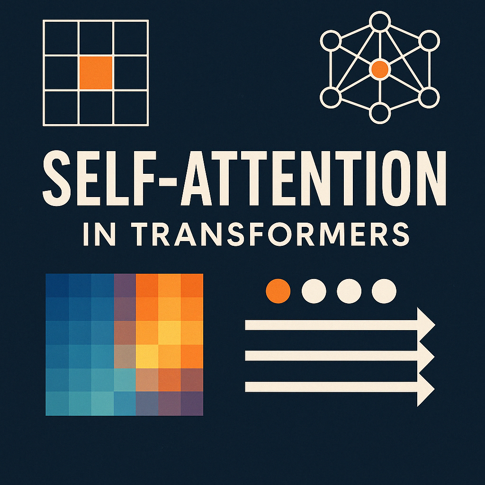{ style="width: 100%; border-radius: 8px;" }


??? info "What is Self Attention?"
    Self-attention is a mechanism that allows a model to weigh the importance of each word in a sentence with respect to others. It's the core building block of transformer models, enabling them to capture contextual relationships between words.


---

## 1. Word to Number: The Foundation Step in NLP

??? info "Why convert words to numbers?"
    In NLP, converting words to numbers is essential because machines can only process numerical data. This conversion enables mathematical operations and pattern recognition in text.

In any NLP use-case—be it sentiment analysis, machine translation, or chatbot development—the very first step is to convert **words into numbers**^[numerical representations that machines can process]. Why? Because machines don't understand text, they only understand numbers.

Over time, several techniques were developed to represent words as vectors (i.e., sequences of numbers). These techniques slowly evolved from simple to smarter methods.

---

### 1.1 One-Hot Encoding (OHE)

This is the most basic method.

Let's say our vocabulary has only 4 words: `["apple", "banana", "cat", "dog"]`.

Now if we want to represent the word `"cat"`, we do:

```python hl_lines="3"
words = ["apple", "banana", "cat", "dog"]
ohe = {
    "apple": [1, 0, 0, 0],
    "banana": [0, 1, 0, 0],
    "cat": [0, 0, 1, 0],
    "dog": [0, 0, 0, 1]
}
```

**Key issue**: All words are equally distant from each other. `"cat"` is no more similar to `"dog"` than it is to `"banana"`. There is no sense of **semantic similarity**.

---

### 1.2 Bag of Words (BoW)

BoW moves ahead by considering how often words appear in a sentence or document.

Let's take two sentences:

- Sentence 1: `"I love apple and banana"`
    
- Sentence 2: `"banana is tasty"`
    

Vocabulary: `["I", "love", "apple", "and", "banana", "is", "tasty"]`

Now we can represent these two as count vectors:

```python hl_lines="2 3"
vocab = ["I", "love", "apple", "and", "banana", "is", "tasty"]
s1 = [1, 1, 1, 1, 1, 0, 0]  # "I love apple and banana"
s2 = [0, 0, 0, 0, 1, 1, 1]  # "banana is tasty"
```

**Problem**: It only captures frequency, not **importance** of a word. Also, it loses the **word order**.

---

### 1.3 TF-IDF (Term Frequency-Inverse Document Frequency)

TF-IDF tries to fix the BoW issues by lowering the weight of **common** words and boosting the weight of **rare but important** ones.

For example, if `"banana"` appears in almost every document but `"tasty"` appears in just a few, then:

- `"banana"` will get **low score**
    
- `"tasty"` will get **high score**
    

This helps highlight the _uniqueness_ of terms in each document.

Still, even with TF-IDF, **semantic meaning and context are missing**.

---

### 1.4 Word Embeddings: A Smarter Way

To go beyond counting, **Word Embeddings**^[dense vector representations that capture semantic meaning] like **Word2Vec**, **GloVe**, and **FastText** came into play.

These methods map words into **dense vectors**, where words with similar meanings are placed close to each other in the vector space.

So:

```
vector("king") - vector("man") + vector("woman") ≈ vector("queen")
```

This is _magical_. It means embeddings capture not just meaning but also **relationships** between words.

But there's a catch.

---

## 2. The Problem with Static Word Embeddings: "Average Meaning"

??? info "The Problem with Static Embeddings"
    Static embeddings assign the same vector to a word regardless of its context, leading to the "average meaning" problem where a word like "bank" gets the same representation whether it refers to a financial institution or a river bank.

Let's say we train Word2Vec on the following example:

- Our dataset has 1000 sentences.
    
- In 900 of them, `"apple"` is used as a fruit.
    
- In 100, `"apple"` refers to the tech company.
    

Assume our word embeddings are in 2D:

- Dimension 1 = **Technology**
    
- Dimension 2 = **Taste**
    

### 2.1 Result:

Because `"apple"` was mostly used as a fruit, its final embedding will lean **heavily toward the taste axis**.

---

### 2.2 Visualizing the Problem

Let's plot it to understand better:
```mermaid
          ↑
          |
   (Taste)|        *apple*  ← closer to taste axis
          |       /
          |      /
          |     /
          |    /
          |   /
          |  /
          | /
          |/_______________________→
              (Technology)
```

Now, if we use this embedding in a machine translation task and encounter a sentence like:

> "He bought an Apple at the store."

The model might translate it as if it's referring to the **fruit**, not the **tech brand**, because the embedding was **static** and trained on mostly fruit context.

This is the problem of **"average meaning"**.

---

### 2.3 The Solution: Contextual Embeddings

What we really want is **context-aware embeddings**.

That is:

- In "He bought an Apple phone" → "Apple" should be close to _Samsung_, _iPhone_
    
- In "He ate an Apple" → "Apple" should be close to _banana_, _mango_
    

This is where **Self-Attention** and models like **BERT** come in.

They take static embeddings and **dynamically adjust them** based on the surrounding words—creating **contextual embeddings**.

So now:

> `"Apple"` in a tech context looks different from `"Apple"` in a fruit context.

These embeddings are no longer _one size fits all_—they're **personalized per sentence**, per word.

That's the game-changer!

---

## 3. Summary: Evolution of Word Representations

In the journey of Natural Language Processing, representing words as numbers is the first and most critical step. Over time, this transformation has matured—from naive methods to highly intelligent contextual models.

### 3.1 Evolution of Word Representations

|Technique|Type|Captures Frequency|Captures Meaning|Handles Context|Key Limitation|
|---|---|---|---|---|---|
|One-Hot Encoding (OHE)|Sparse & Static|❌|❌|❌|All words equally distant. No semantic link.|
|Bag of Words (BoW)|Sparse & Static|✅|❌|❌|Ignores word order & meaning.|
|TF-IDF|Sparse & Static|✅ (weighted)|✅ (importance)|❌|Still no semantics or context.|
|Word Embeddings (Word2Vec, GloVe)|Dense & Static|✅|✅|❌|One meaning per word: **average meaning** issue|
|Contextual Embeddings (BERT, etc.)|Dense & Dynamic|✅|✅|✅|✅ Handles multiple meanings per word|

### 3.2 TL;DR

> **Static embeddings** give us an "average meaning" of a word.  
> But **language is dynamic**.  
> To truly understand it, we need **contextual embeddings**—and that's what modern transformer models deliver.

---

## 4. From Static Embeddings to Context-Aware Understanding

??? info "The Need for Context"
    Context is crucial in language understanding. The same word can have different meanings based on its surrounding words, which static embeddings fail to capture.

In the previous section, we saw how static word embeddings—no matter how powerful—struggle when a single word has multiple meanings. Our example of the word _"apple"_ highlighted the problem of **average meaning**: static embeddings simply collapse all usages of a word into one vector, ignoring context entirely.

This realization naturally leads us to ask:

> **Can we create different embeddings for the same word, based on its context?**

Let's explore this idea from scratch—as if we are inventing it ourselves.

---

### 4.1 Starting With a Thought Experiment

Take the following two short sentences:

- Sentence 1: _Money bank grows_
    
- Sentence 2: _River bank flows_
    

Clearly, the word **bank** has two distinct meanings here:

- A **financial institution** in Sentence 1.
    
- The **side of a river** in Sentence 2.
    

Yet, static embeddings would give "bank" the same vector in both sentences. That's a problem.

Now imagine this: instead of keeping the embedding of "bank" fixed, what if we adjusted it dynamically based on its neighboring words?

That is, instead of treating `e(bank)` as a standalone vector, we define a **new embedding** like this:

```
e(bank)^new = α * e(money) + β * e(bank) + γ * e(grows)
```

and similarly for Sentence 2:

```
e(bank)^new = α' * e(river) + β' * e(bank) + γ' * e(flows)
```

Here, the new representation of "bank" is influenced by the _context_ in which it appears.

When we do this, something powerful happens:

> "Bank" now carries the meaning it was meant to carry—in that sentence, in that moment.

---

### 4.2 Visualizing Dynamic Embeddings

Below is a representation showing how weights (α, β, γ) can differ across contexts:


---
Context 1: "money bank grows"

```
money = 0.7 * money + 0.2 * bank + 0.1 * grows
bank  = 0.25 * money + 0.7 * bank + 0.05 * grows
grows = 0.1 * money + 0.2 * bank + 0.7 * grows
```

 Context 2: "river bank flows"

```
river = 0.8 * river + 0.15 * bank + 0.05 * flows
bank  = 0.2 * river + 0.78 * bank + 0.02 * flows
flows = 0.4 * river + 0.01 * bank + 0.59 * flows
```

These weights control how much attention each neighboring word should get when building a word's new embedding.

---

### 4.3 Deriving the Weights: Self-Attention Equation

So far we've assumed weights like 0.7, 0.2, and 0.1 magically appear. Let's go deeper.

We realize these weights should come from **how similar** the surrounding words are to the word we're updating. The more relevant a word is, the more it should contribute.

How do we measure similarity between vectors?  
Using the **dot product**.

Mathematically:

```
e(bank)^new = 
  (e_bank · e_money) * e_money 
+ (e_bank · e_bank) * e_bank 
+ (e_bank · e_grows) * e_grows
```

This is illustrated below:

#### Self-Attention Equation (Dot Product Form)

$\mathbf{e}_{\text{bank}}^{(\text{new})} = \left( \mathbf{e}_{\text{bank}} \cdot \mathbf{e}_{\text{money}}^\top \right) \mathbf{e}_{\text{money}} + \left( \mathbf{e}_{\text{bank}} \cdot \mathbf{e}_{\text{bank}}^\top \right) \mathbf{e}_{\text{bank}} + \left( \mathbf{e}_{\text{bank}} \cdot \mathbf{e}_{\text{grows}}^\top \right) \mathbf{e}_{\text{grows}}$

#### Explanation

Each term computes a **similarity score** (via dot product) between the target word `bank` and a context word (`money`, `bank`, or `grows`). That score is then used to weight the corresponding word vector, forming a **contextual embedding** for `bank`.

These dot products reflect how much one word relates to another. But raw dot products can be large or skewed. So we **normalize** them—using a softmax function. This ensures:

- All weights add up to 1
    
- The final vector remains stable and interpretable
    

---

### 4.4 Why Context Matters: Explanation with Examples

Let's take a few examples to illustrate the concept of contextual embeddings:

1. **"He bought an Apple phone"**:
    - "Apple" should be close to _Samsung_, _iPhone_
     
2. **"He ate an Apple"**:
    - "Apple" should be close to _banana_, _mango_
     
These examples show how contextual embeddings adapt the meaning of a word based on its surrounding words.

---

### 4.5 From Intuition to Mechanism: The Self-Attention Insight

What we just derived by reasoning—that each word's representation should depend on others—is exactly what the **self-attention** mechanism does.

Each word:

- Starts with a static embedding (from Word2Vec, GloVe, etc.)
    
- Passes through a layer that calculates similarity with all other words
    
- Gets updated into a new, context-sensitive embedding
    

The figure below shows this in action:

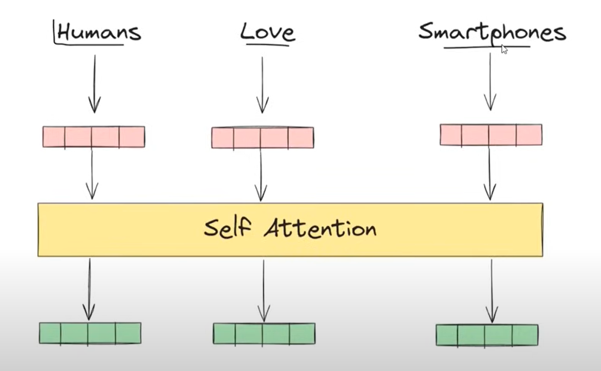

As shown:

- Words like "Humans", "Love", and "Smartphones" begin with their static embeddings (pink)
    
- Self-attention computes inter-word relationships
    
- The output is a **contextualized representation** for each word (green)
    

"Smartphones" may mean different things in different contexts—but now, its embedding reflects that.

---

### 4.6 Section Summary

We started with the challenge of **static embeddings** failing to distinguish meaning based on context.  
By thinking deeply and modeling interactions between words as **weighted combinations**, we found a dynamic way to re-compute word vectors.

This insight forms the basis of **self-attention**, a cornerstone of modern NLP systems.  
It's the key that unlocks contextual understanding—and sets the stage for models like BERT and GPT.

Next, we'll examine how this mechanism works internally: through **queries**, **keys**, and **values**. That's where the full design of attention comes to life.

---

## 5. Formalizing Self-Attention: From Intuition to Architecture

??? info "The Architecture of Self-Attention"
    Self-attention formalizes the intuitive idea of contextual embeddings into a mathematical architecture that can be efficiently computed and learned.

Previously, we discovered that a word's embedding can be made **contextual** by computing a weighted sum of all other word embeddings in a sentence. This was our first-principles approach—derived from basic reasoning about meaning and similarity.

But we now want to **scale this** beyond a few hand-crafted sentences.

---

### 5.1 Step-by-Step: Turning the Idea into Architecture

Let's revisit our example sentence:

**money bank grows**

We want to compute a new embedding for each word based on its similarity with all other words.

Below is the **architectural breakdown** of this process for each word:

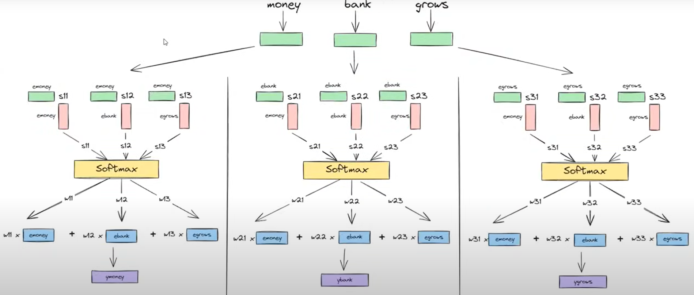

Here's what's happening:

- Each word is compared with every other word (using dot product) → similarity scores (sᵢⱼ)
    
- These scores are passed through a softmax to get attention weights (wᵢⱼ)
    
- A weighted sum of all word embeddings is computed → contextual output (yᵢ)
    

This process is repeated **for every word** in parallel.

---

### 5.2 Scaling with Linear Algebra

Since each word needs to attend to all other words, we can compute this efficiently using **matrix multiplication**.

Here's how the entire process looks in matrix form:

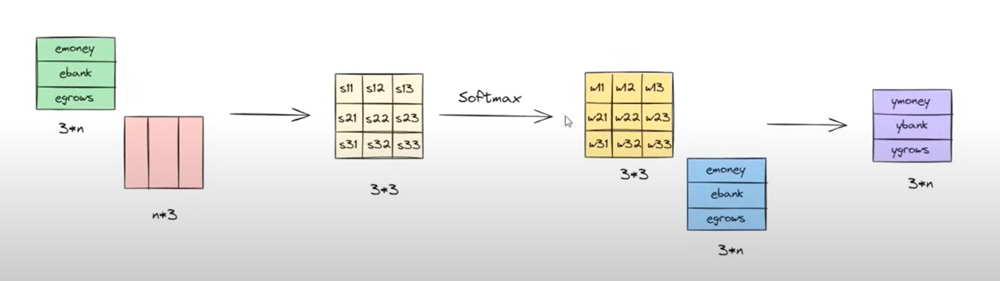

Explanation:

- We start with a matrix of all word embeddings (shape: 3 × _n_)
    
- Compute similarity scores (dot product) → 3 × 3 matrix
    
- Apply softmax row-wise → attention weights
    
- Multiply with original embeddings → new embeddings for each word
    

This turns our manually defined weighted sum into a **vectorized operation**, allowing for fast and parallel computation even for large sequences.

---

### 5.3 Advantages of This Architecture

1. **Parallelism**:  
    All operations—dot products, softmax, weighted sums—can be computed **simultaneously** for all words.  
    This makes the method **highly scalable** and ideal for large datasets and long sequences.
    
2. **Contextual Embeddings**:  
    Each word now gets an embedding that is influenced by every other word in the sentence—capturing nuanced meaning.
    

---

### 5.4 Two Key Problems Identified

1. **Loss of Order Information**  
    Because all words are processed in parallel, the model doesn't know which word came first or second.  
    It treats the sentence as a bag of words.
    
    We will address this later using **positional encoding**.
    
2. **No Learnable Parameters**  
    Right now, all similarity computations are purely based on input embeddings.  
    There are **no weights, no biases**, and therefore **no learning**.  
    The contextual embeddings produced are **generic**—they reflect context, but not the task.
    

---

### 5.5 Why Learnable Parameters Are Needed

Let's take an example to clarify.

Suppose we're doing **sentiment analysis** on these two sentences:

- _"I like this bank"_
    
- _"I dislike this bank"_
    

In both cases, "bank" appears in a similar context, but the **task-specific requirement** is to **focus on sentiment**—"like" vs. "dislike".

Without learnable parameters, the system will not learn that:

- In sentence 1, "bank" is viewed positively.
    
- In sentence 2, "bank" is viewed negatively.
    

In short:

> We need the model to **learn from data** and adapt its embeddings depending on the **task objective**.

---

## 6. Introducing Learnable Parameters in Self-Attention

??? info "Learnable Parameters in Attention"
    Learnable parameters allow the attention mechanism to adapt to specific tasks and learn which words to focus on in different contexts.

In our last step, we derived the self-attention operation using basic matrix algebra. The entire operation was composed of three core parts:

1. A **dot product** to calculate similarity between words
    
2. A **softmax** to normalize these similarities into attention weights
    
3. A **weighted sum** to generate new contextual embeddings
    

This is summarized below:

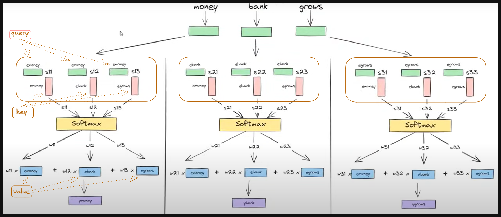

However, one important limitation still remains:

> The model has **no learnable parameters**. That means it cannot learn from data or adapt based on the task.

So the natural question becomes—**where** in this architecture can we introduce trainable weights?

If we look closely, only two operations involve actual vector interactions:

- The **first dot product** between embeddings → where we compute similarity
    
- The **final weighted sum** to produce the contextual output
    

These are the points where we can inject learnable parameters.

---

### 6.1 Queries, Keys, and Values Explained

Let's revisit the self-attention diagram, but now highlight three distinct roles each embedding plays:


We can now name the roles as follows:

- **Query**^[used to determine relevance]: The word for which we are calculating context
    
- **Key**^[used for comparison]: The words we are comparing the query to (to compute similarity)
    
- **Value**^[used for final representation]: The content we will use to compute the final representation, based on attention weights
    

These terms might seem new in the NLP context, but they're inspired from traditional programming:

> In a dictionary/map:
> 
> - You issue a **query** (what you're searching for)
>     
> - It is matched with a **key**
>     
> - And you retrieve a **value**
>     

Self-attention is conceptually similar:  
Each word "queries" the sentence for related information, finds "keys", and pulls out their corresponding "values".

---

### 6.2 A Problem: One Embedding, Three Roles

In our setup so far, **every word uses the same vector** to act as a Query, a Key, and a Value.

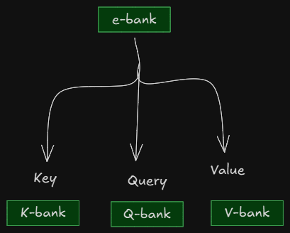

This is not ideal.

Why? Because each of these roles requires different behavior:

- As a **query**, the word should try to find relevant neighbors.
    
- As a **key**, it should offer meaningful comparison metrics.
    
- As a **value**, it should offer rich contextual information.
    

---

### 6.3 Solution: Projecting into Separate Spaces

Instead of forcing a single embedding to wear all three hats, let's _transform_ it into **three different vectors**:

- Query vector
    
- Key vector
    
- Value vector
    

Each derived using a separate **learnable linear projection**.

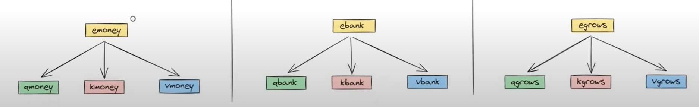

This separation allows the model to **specialize** each part:

- The **Query projection** learns how to _ask_ relevant questions.
    
- The **Key projection** learns how to _represent_ itself to be attended to.
    
- The **Value projection** learns how to _contribute_ to final output when attended.
    

---

### 6.4 Intuitive Benefits of Q/K/V Separation

Let's say you're in a room full of people and you're interested in finding someone to collaborate on a project.

- As the **query**, you are looking for someone who aligns with your interests.
    
- Everyone else has a **key** that describes their area of expertise.
    
- Once you identify relevant people, you ask them to share insights (their **values**).
    

Now, imagine if everyone had just one description for all three roles. You'd miss out on subtle but crucial distinctions.

By allowing separate **Q, K, and V vectors**, we give the model the **freedom to behave differently** in each role—which is exactly what a robust learning system needs.

---

### 6.5 Conclusion

By projecting our original embedding into **three distinct learnable vectors (Q, K, V)**, we turn self-attention into a truly **trainable** mechanism:

- Capable of **learning from data**
    
- Adapting to different tasks
    
- Assigning role-specific behavior to each word in the sentence
    

In the next section, we will formalize how these Query, Key, and Value vectors are generated using linear layers, and how the attention mechanism operates with them from end to end.

Let's now move from concept to implementation.

---

## 7. Building the Query, Key, and Value Vectors

??? info "QKV Generation"
    The process of generating Query, Key, and Value vectors from input embeddings is the first step in implementing self-attention.

So far, we've established that:

- Each word in a sentence needs to play **three different roles**: query, key, and value.
    
- These roles should ideally have **separate vector representations**.
    
- We can achieve this by **transforming** the original word embedding into three new vectors.
    

Now the core question becomes:

> **How do we generate the Q, K, and V vectors from a given word embedding?**

This is what we'll design next.

---

### 7.1 Visualizing the Goal

Let's start by imagining what we want to do:

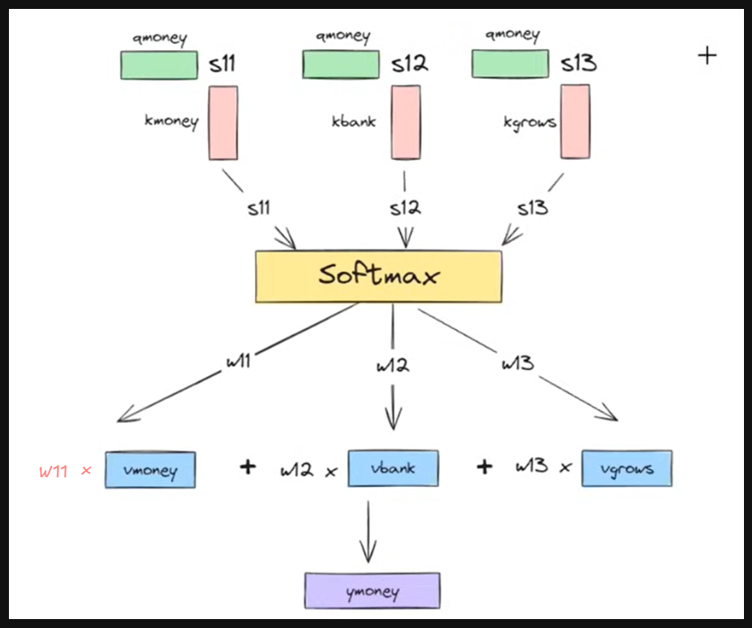

Each word embedding (like `emoney`) should be transformed into:

- `qmoney`: Query vector
    
- `kmoney`: Key vector
    
- `vmoney`: Value vector
    

And similarly for every word.

---

### 7.2 How Do We Transform a Vector?

There are two basic methods for generating new vectors from an existing one:

1. **Scaling** (e.g., multiply each value by 2)
    
2. **Linear Transformation** (matrix multiplication)
    

For our case, **linear transformation** is ideal because:

- It allows flexible, trainable changes.
    
- It preserves relative patterns while allowing reshaping of meaning.
    

---

### 7.3 Linear Transformations with Weight Matrices

We'll use three learnable matrices:

- $W_q$ : for generating Query vectors
    
- $W_k$ : for generating Key vectors
    
- $W_v$ : for generating Value vectors
    

Each of these will be applied to the original embedding:

```python hl_lines="2 3 4"
def generate_qkv(embedding, Wq, Wk, Wv):
    q = torch.matmul(embedding, Wq)  # Query projection
    k = torch.matmul(embedding, Wk)  # Key projection
    v = torch.matmul(embedding, Wv)  # Value projection
    return q, k, v
```

Initially, these matrices $W_q, W_k, W_v$ are **randomly initialized**, but they are **trainable**—meaning they will be updated during backpropagation.  
This is the **learning** phase of the self-attention module.

We now have a way to extract **task-specific Q, K, and V vectors** from each input word embedding.

---

### 7.4 End-to-End Flow for a Single Word

Let's now visualize how a single word's embedding goes through the entire QKV transformation and attention calculation:

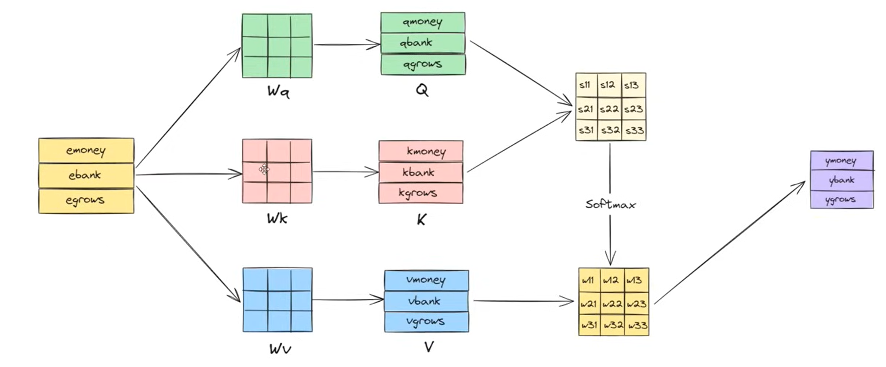

- Each word is projected to Q, K, and V using its respective weight matrices.
    
- The dot product between the **query** and all **keys** is computed.
    
- Attention weights (after softmax) are used to combine **values**.
    
- Final result: a new, **contextualized output vector** for the word.
    

---

### 7.5 Extending to the Whole Sequence

Since these operations are all **linear and parallelizable**, we can compute Q, K, and V for all words in the sequence at once.

This is shown in the next diagram:

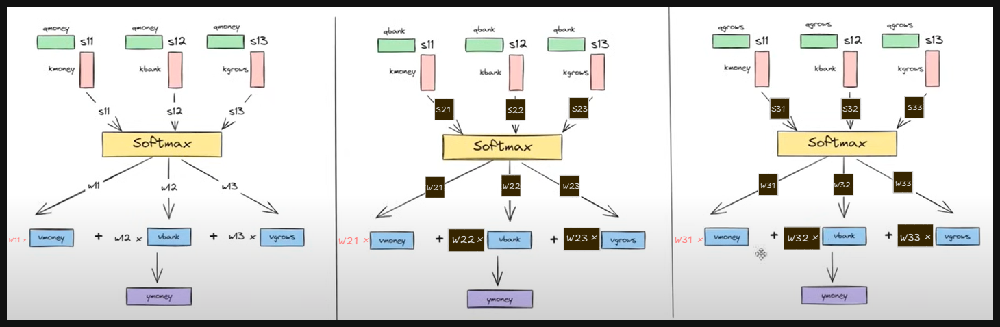

Every step—from embedding to final output—can be done **in matrix form**, enabling efficient training and inference.

---

### 7.6 Full Matrix-Level Self-Attention Flow

Here's the complete view of self-attention at matrix scale:

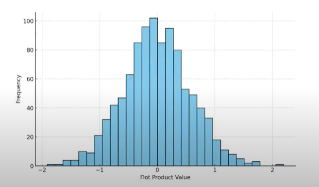

**Step-by-step explanation:**

1. **Input Word Embeddings** (3 × d):  
    Each row is a word embedding: `emoney`, `ebank`, `egrows`.
    
2. **Linear Projections**:
    
    - Multiply the embedding matrix with $W_q, W_k, W_v$ to get:
        
        - Q: Query matrix (3 × d₁)
            
        - K: Key matrix (3 × d₁)
            
        - V: Value matrix (3 × d₂)
            
3. **Similarity Scores**:
    
    - Compute dot product: $Q \cdot K^T$ → gives similarity matrix (3 × 3)
        
4. **Softmax**:
    
    - Normalize each row of similarity scores to get attention weights (3 × 3)
        
5. **Weighted Sum**:
    
    - Multiply attention weights with the Value matrix:  
        $\text{Attention Weights} \cdot V$
        
6. **Final Output**:
    
    - The resulting matrix contains contextualized embeddings for each word in the input.
        

Here one question may arise after reading linear projections:

#### Question:

**Q: In self-attention, do the Query (Q), Key (K), and Value (V) matrices always have the same dimensionality? If not, which dimensions must match, and how are these typically handled in Transformer models?**

#### Answer

No, the Query (Q), Key (K), and Value (V) matrices in self-attention do **not** always need to have the same dimensionality. However, certain constraints must be satisfied for the self-attention mechanism to function correctly.

At the core of self-attention lies the dot product between the **query** and **key** vectors, which yields the attention scores. For this operation to be valid and meaningful, the **Query and Key matrices must have the same feature dimension**, typically denoted as $d_k$. This ensures that the dot product $QK^\top$ is well-defined and produces an attention matrix of shape $n \times n$, where $n$ is the sequence length.

In contrast, the **Value (V) matrix** does **not** participate in the dot product. Instead, it is used in the final step, where the attention weights are applied as a weighted sum over the values. Since scalar weights can be applied to vectors of any dimension, the **Value matrix can have a different dimensionality**, denoted as $d_v$.

---

##### Dimensionality in Standard Transformer Models

In typical Transformer architectures, the input sequence $X \in \mathbb{R}^{n \times d_m}$ (where $d_m$ is the model dimension) is projected into Q, K, and V using learned linear transformations:

$Q = XW^Q \in \mathbb{R}^{n \times d_k}, \quad K = XW^K \in \mathbb{R}^{n \times d_k}, \quad V = XW^V \in \mathbb{R}^{n \times d_v}$

In multi-head attention, this is often further constrained such that:

$d_k = d_v = \frac{d_m}{h}$

where $h$ is the number of attention heads. This ensures that each head operates in a lower-dimensional subspace and simplifies the implementation by keeping dimensions consistent across Q, K, and V.

---

##### Our Case

In practice, more flexible configurations are also valid. For example, consider the setup:

$Q \in \mathbb{R}^{3 \times d_1}, \quad K \in \mathbb{R}^{3 \times d_1}, \quad V \in \mathbb{R}^{3 \times d_2}$

This configuration works, provided:

- $d_1 = d_k$, the shared dimension of queries and keys.
    
- $d_2 = d_v$, the value dimension, which can differ from $d_k$.
    

Such setups are occasionally used in custom attention mechanisms where the output representation is intentionally designed to differ in size from the attention scoring space.

---

##### Summary

- **Q and K** must share the same dimension $d_k$ to allow valid dot-product attention computation.
    
- **V** can have a different dimension $d_v$, since it is only involved in the final weighted sum.
    
- In standard Transformers, it's common to set $d_k = d_v = d_m / h$, but this is not a strict requirement.
    

This flexibility allows the architecture to adapt the representation space of the attention output independently from the space used to compute attention scores.

---

### 7.7 Section Summary

With this transformation mechanism in place, we now have a complete self-attention module that:

- Uses learnable parameters ($Wq, Wk, Wv$)
      
- Computes attention dynamically based on context
    
- Produces **contextualized, task-aware embeddings**
    

This attention operation is the **core building block of Transformer models**.

---

## 8. Why Do We Need a Scaling Factor in Attention?

??? info "The Need for Scaling"
    The scaling factor in attention is crucial for maintaining stable gradients and preventing the softmax function from producing extremely peaked distributions.

Until now, we've derived the self-attention formula as:

$\text{Attention}(Q, K, V) = \text{Softmax}(Q \cdot K^T) \cdot V$

This formulation is correct and aligns with everything we've built step-by-step so far.

However, when we read the original Transformer paper—**"Attention is All You Need"**—we encounter a slightly different version of the equation:

$\text{Attention}(Q, K, V) = \text{Softmax}\left(\frac{Q \cdot K^T}{\sqrt{d_k}}\right) \cdot V$

Where:

- $d_k$ is the **dimension of the key vector**
    

So now, we naturally wonder:

> Why is this **$\frac{1}{\sqrt{d_k}}$** scaling factor needed?  
> Why not just use dot product directly?

To answer this, we need to understand a **property of dot products** in high-dimensional vector spaces.

---

### 8.1 Nature of Dot Product in High Dimensions

In linear algebra, it's a well-known fact:

> As the **dimension** of the vectors increases, the **variance of their dot product** increases too.

Let's unpack this.

Suppose we randomly sample two vectors and take their dot product:

- In 3 dimensions, their dot product stays within a narrow range.
    
- But in 100 or 1000 dimensions, the result fluctuates much more.
    

We ran an experiment:  
We generated 1000 random pairs of vectors for each dimension and plotted the dot product values.

Here are the histograms:

---

#### Dot Product Distributions Across Dimensions

**Dimension = 3**

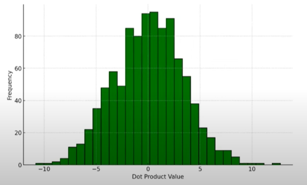

**Dimension = 100**

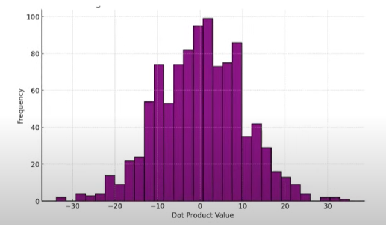

**Dimension = 1000**

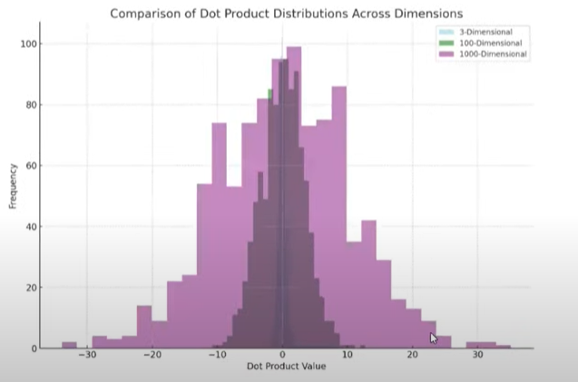

**Overlay of All Three**


---

From these plots, it's clear:

- **As dimension increases, the variance of dot product values also increases.**
    
- High variance means some values will be **very high**, and others **very low**.
    

This leads us to the next critical question.

---

### 8.2 Why High Variance Is a Problem in Attention?

Recall that in attention, the dot products go through a **Softmax** layer.

#### What Softmax Does:

Given inputs $[x_1, x_2, ..., x_n]$, Softmax computes:

${Softmax}(x_i) = \frac{e^{x_i}}{\sum_j e^{x_j}}$

This converts raw scores into a **probability distribution**, where all values sum to 1.

But since it's **exponential**, Softmax has a sharp sensitivity to large differences:

- A slightly larger value becomes **dominant** after exponentiation.
    
- Smaller values become almost **zero**.
    

This effect is **amplified** when input values (like dot products) have high variance.

---

#### What This Means in Practice

If attention scores are very different due to high variance, then:

- The softmax output becomes **very peaky**.
    
- Only one token gets all the attention.
    
- The rest are **ignored** completely.
    

This hurts learning:

- During backpropagation, gradients for ignored tokens approach **zero**.
    
- This causes a **vanishing gradient problem** for non-dominant tokens.
    
- As a result, the model **fails to learn meaningful attention patterns**.
    

This is shown in the illustration below:

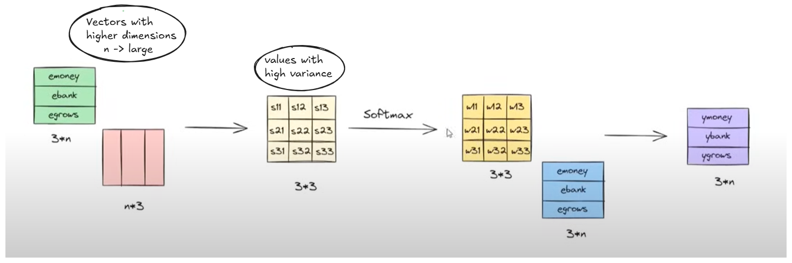

---

### 8.3 How to Fix It?

We have two possible solutions:

1. **Reduce dimensionality** of the vectors
    
    - But this would degrade the richness of word embeddings
        
    - Less capacity → worse performance
        
2. **Scale the dot product values**
    
    - So they don't become too large as dimension increases
        
    - Keeps softmax well-behaved
        

Clearly, option 2 is preferable.

---

## 9. How to Choose the Right Scaling Factor?

??? info "Choosing the Scaling Factor"
    The scaling factor is derived from the relationship between vector dimensions and dot product variance.

In the previous section, we concluded that high-dimensional dot products lead to **high variance**, which causes issues when passed through **Softmax**.

To fix this, we introduced a **scaling factor**:

$\frac{1}{\sqrt{d_k}}$

Now let's **derive this scaling factor** using basic probability theory and experimental observation.

---

### 9.1 Theoretical Foundation: Variance and Scaling

We begin with a well-known property in statistics:

> **If you scale a random variable $X$ by a constant $c$, the variance scales by $c^2$:**
> 
> $\text{Var}(Y) = c^2 \cdot \text{Var}(X) \quad \text{where } Y = cX$

This is a key relationship, and we will use it to deduce our scaling factor.

---

### 9.2 Experimental Observation: Dimensionality and Variance

Let's suppose we sample 1000 random pairs of vectors from a standard normal distribution and take their dot product in various dimensions.

We observed the following:

| Dimension $d$ | Approx. Variance of Dot Product |
| ------------- | ------------------------------- |
| 1             | $\text{Var}(X)$                 |
| 2             | $2 \cdot \text{Var}(X)$         |
| 3             | $3 \cdot \text{Var}(X)$         |
| ...           | ...                             |
| $d_k$         | $d_k \cdot \text{Var}(X)$       |

This tells us:

> Dot product variance **increases linearly** with dimension.

Let's define:

- $X_d$: dot product value in $d$ dimensions
    
- Then:
    
$\text{Var}(X_d) = d_k \cdot \text{Var}(X)$

---

### 9.3 Keeping Variance Constant

Now, our goal is to bring the variance back to its original value, i.e., $\text{Var}(X)$, no matter the dimension $d_k$.

Let's apply a **scaling factor $c$** to our dot product such that:

$\text{Var}(Y) = \text{Var}(c \cdot X_d) = c^2 \cdot \text{Var}(X_d)$

We want:

$\text{Var}(Y) = \text{Var}(X)$

Substitute in:

$c^2 \cdot (d_k \cdot \text{Var}(X)) = \text{Var}(X)$

Divide both sides by $\text{Var}(X)$:

$c^2 \cdot d_k = 1$ 


$c^2 = \frac{1}{d_k} \quad \Rightarrow \quad c = \frac{1}{\sqrt{d_k}}$

---

### 9.4 Final Derivation of Scaling Factor

To maintain **stable variance across dimensions** and avoid exploding Softmax values, we must scale the dot product matrix by:

$\boxed{ \frac{1}{\sqrt{d_k}} }$

This ensures:

- Variance remains **independent of dimension**
    
- Softmax stays **numerically stable**
    
- Gradients remain **well-behaved during training**
    

And thus, the final attention formula becomes:

$\boxed{ \text{Attention}(Q, K, V) = \text{Softmax}\left(\frac{Q \cdot K^T}{\sqrt{d_k}}\right) \cdot V }$

This concludes the deep dive into the scaling factor.

---

## 10. Final Conclusion

### 10.1 Why Scaling Matters

The scaling factor $\frac{1}{\sqrt{d_k}}$ is crucial for maintaining stable attention weights and preventing exploding gradients.

### 10.2 Final Attention Equation

The final attention formula is:

$\text{Attention}(Q, K, V) = \text{Softmax}\left(\frac{Q \cdot K^T}{\sqrt{d_k}}\right) \cdot V$

### 10.3 Key Takeaways

1. **Scaling factor** $\frac{1}{\sqrt{d_k}}$ is necessary to maintain stable attention weights.
     
2. **Dot product** $Q \cdot K^T$ is computed before applying Softmax.
     
3. **Softmax** converts raw scores into a probability distribution.
     
4. **Attention weights** are then used to combine **values** to produce contextual embeddings.


This concludes the detailed explanation of self-attention and its components.

